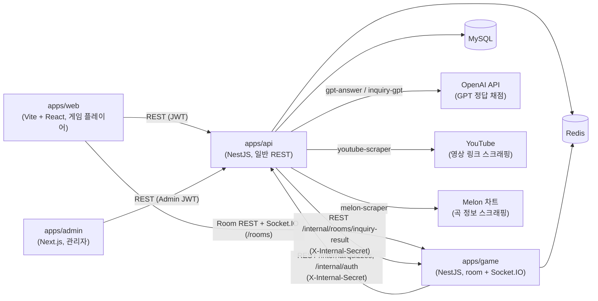
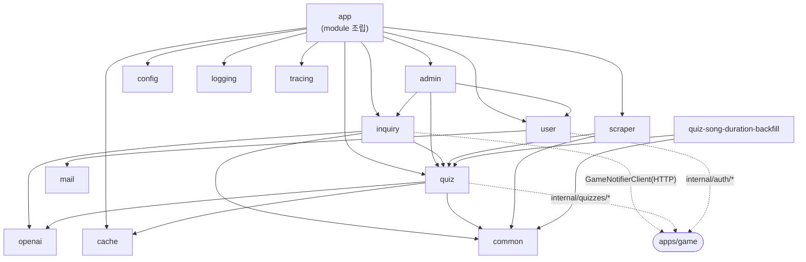
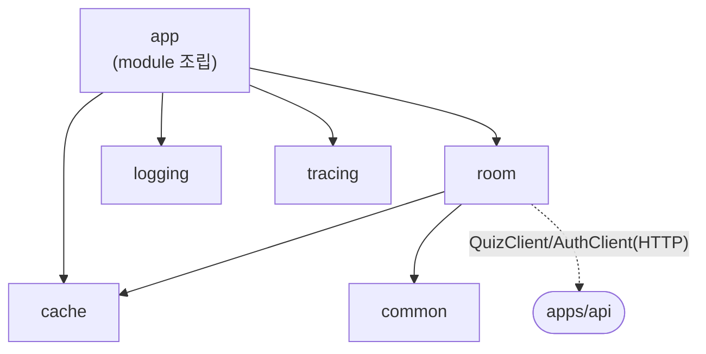

# Architecture

song-quiz 모노레포의 앱 간 / `apps/api`·`apps/game` 내부 모듈 간 의존 관계를 정리한다. 각 앱의 내부 규칙은 앱별 `CLAUDE.md`를 따른다.

## 시스템 개요



- `apps/web`과 `apps/admin`은 서로 의존하지 않는다. 두 프런트엔드 모두 백엔드가 반환하는 DTO 형식을 각자 `src/types/`에 미러링해서 쓴다 (자동 동기화 없음 — 타입 변경 시 관련된 곳을 수동으로 맞춰야 함).
- 실시간 방(room) 상태는 REST가 아니라 `apps/game`의 `/rooms` Socket.IO 네임스페이스로만 갱신된다. Room REST(생성/입장/퇴장 등)와 Socket.IO 모두 `apps/game`이 소유한다.
- `apps/api`와 `apps/game`은 서로의 TypeORM Repository/Entity나 도메인 클래스를 직접 import하지 않는다 — 필요한 데이터는 `X-Internal-Secret` 헤더로 보호되는 `/internal/*` REST 엔드포인트로만 주고받는다. 배경은 [`ADR-0004`](docs/adr/0004-game-service-split.md) 참고.
- `apps/game`은 게임 시작 시점에 그 게임 전체 라운드 데이터(곡 정보·정답)를 `apps/api`에서 한 번에 스냅샷으로 받아 자신의 Redis에 캐시해두고, 라운드가 진행되는 동안에는 `apps/api`를 다시 호출하지 않는다.

## `apps/api` 내부 모듈 의존성



- `cache`, `common`, `config`, `logging`, `tracing`, `mail`, `openai`는 다른 도메인 모듈을 참조하지 않는 leaf/infra 모듈이다. 여기를 고치면 영향 범위가 넓으니(quiz·inquiry·user가 모두 의존) 변경 전 역방향 참조를 확인한다.
- `tracing`(`packages/tracing`)은 OpenTelemetry NodeSDK로 HTTP inbound/outbound·Express·NestJS·mysql2를 자동 계측한다. `src/main.ts`의 첫 import(`import './tracing'`)에서 `startTracing()`을 호출해 다른 모듈이 require되기 전에 계측을 건다 — NestJS 모듈 그래프 밖에서 부트스트랩 시점에 붙는다는 점이 `logging`과 같다. production에서 `OTEL_EXPORTER_OTLP_ENDPOINT`가 없으면 트레이싱을 비활성화한다(WARN 1회). ioredis(v6)는 계측 라이브러리 지원 범위 밖이라 자동 계측 대상에서 제외된다.
- `admin`이 `inquiry`/`quiz`/`user` 서비스를 직접 참조한다 — 관리자 API 하나를 바꾸면 3개 도메인 모듈에 동시 영향을 줄 수 있다.
- `room` 모듈은 더 이상 `apps/api`에 없다(`apps/game`으로 이동). `inquiry -> room` 직접 의존도 함께 제거됐고, 지금은 `inquiry`가 `GameNotifierClient`로 `apps/game`을 HTTP 호출하는 형태로 방향이 반대다.
- `quiz`/`user`는 각자 `internal/` 하위에 `apps/game` 전용 컨트롤러를 두고 있다 — 이 엔드포인트의 요청/응답 형식을 바꾸면 `apps/game`의 `QuizClient`/`AuthClient`도 함께 확인한다.
- `quiz-song-duration-backfill`은 `quiz`에만 의존하는 독립적인 1회성 배치 모듈이다.

## `apps/game` 내부 모듈 의존성

`apps/game`은 `room` 도메인 하나만 갖는 서비스다(경계는 [`apps/game/CLAUDE.md`](apps/game/CLAUDE.md) 참고).



- `cache`/`common`은 `apps/api`의 동일 이름 모듈과 목적이 같지만, 공유 패키지 없이 파일을 그대로 복제해 각자 유지한다(ADR-0003과 동일한 이유).
- `logging`은 위 둘과 달리 일부가 `packages/logger`(신규 워크스페이스)로 공유된다 — `LogContext`/`StructuredLogger`/requestId·traceId 전파/exception filter/redaction/formatter 등 서비스 독립적인 부분은 `packages/logger`에 있고, `AccessLogMiddleware`(무엇을 얼마나 남길지가 api/game마다 다를 수 있는 정책)와 `access-logger.factory.ts`의 winston 인스턴스(파일 경로 등)는 여전히 각 앱에 복제되어 있다. `apps/api`도 동일하게 `packages/logger`를 사용한다.
- `tracing`은 `packages/tracing`(신규 워크스페이스)을 그대로 사용한다 — api/game 모두 `src/main.ts`의 첫 import에서 `startTracing({ service: 'api' | 'game', ... })`을 호출한다. `packages/logger`의 requestId/traceId 전파 로직이 OTel 활성 span에서 실제 traceId/spanId를 읽어오므로, 두 패키지는 함께 동작한다(상세는 위 `apps/api` 섹션의 `tracing` 설명 참고).
- `room`이 `apps/api`를 호출하는 유일한 경로는 `room/clients/quiz.client.ts`, `room/clients/auth.client.ts`다. TypeORM Repository나 `apps/api`의 도메인 클래스를 직접 참조하지 않는다.

## Observability

```text
Logs    : StructuredLogger → PM2(파일) → CloudWatch Agent → CloudWatch Logs
Metrics : CloudWatch Agent(EC2 Memory/Disk) / Metric Filter(QuizSnapshotFailure 등) → CloudWatch Metrics
Traces  : packages/tracing(OTel) → OTLP/HTTP(127.0.0.1:4318) → CloudWatch Agent → X-Ray/CloudWatch Traces
```

- `requestId`: 애플리케이션/운영 로그 correlation(자체 발급, `x-request-id`로 internal 호출 간 전파).
- `traceId`/`spanId`: 실제 OpenTelemetry 분산 trace/현재 span. `packages/tracing`이 붙인 자동 계측(http/express/undici/mysql2)이 OTLP로 export하며, game↔api 간 전파는 자체 헤더가 아니라 W3C `traceparent`(OTel 표준)로 이루어진다.
- CloudWatch Agent는 `127.0.0.1:4318`에서만 OTLP를 수신한다(Security Group에 열려 있지 않음). 설정은 `infra/terraform/environments/prod/cloudwatch-agent/`(Terraform 리소스 아님, EC2에 수동 적용) 참고.

## 외부 연동

| 연동 대상 | 위치 | 용도 |
|---|---|---|
| OpenAI API | `apps/api/src/openai/openai-chat.client.ts` | GPT 기반 정답 채점(`quiz`), 문의 자동 응답(`inquiry`) |
| YouTube | `apps/api/src/quiz/youtube-scraper.client.ts` | 퀴즈용 영상 링크 스크래핑 |
| Melon 차트 | `apps/api/src/scraper/melon-scraper.client.ts` | 곡/아티스트 메타데이터 스크래핑 |

이 표에 없는 새 외부 연동을 추가하면 이 문서도 함께 갱신한다.
