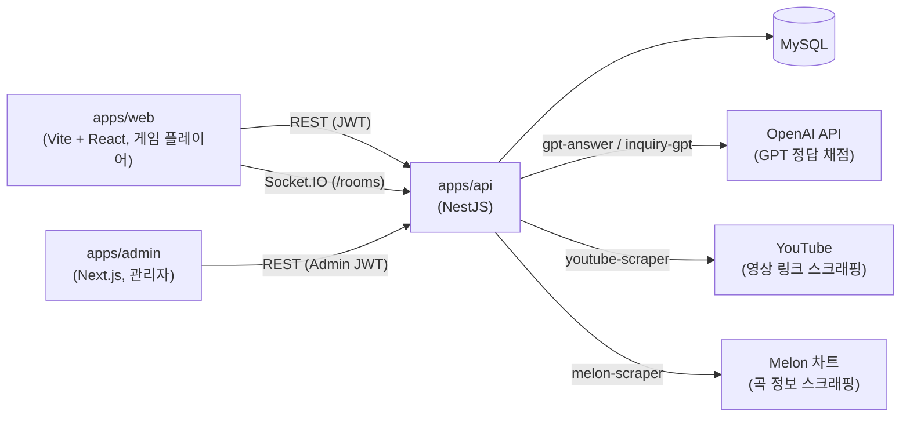
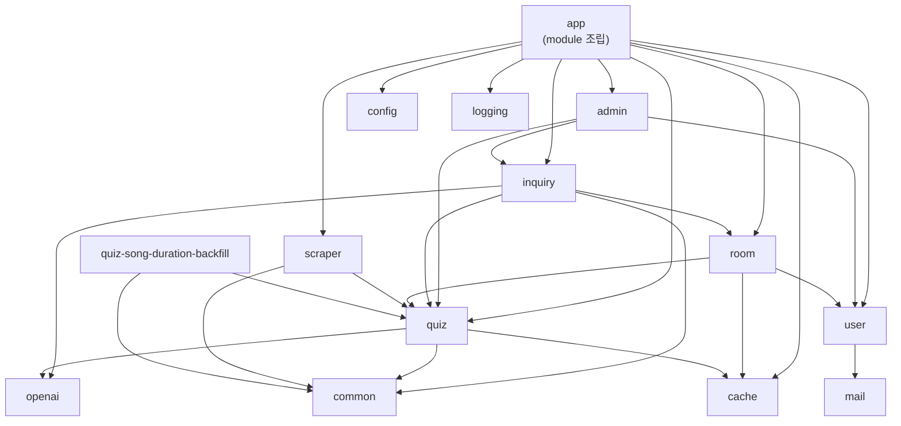

# Architecture

song-quiz 모노레포의 앱 간 / `apps/api` 내부 모듈 간 의존 관계를 정리한다. 각 앱의 내부 규칙은 앱별 `CLAUDE.md`를 따른다.

## 시스템 개요

- `apps/web`과 `apps/admin`은 서로 의존하지 않는다. 두 프런트엔드 모두 `apps/api`의 DTO 형식을 각자 `src/types/`에 미러링해서 쓴다 (자동 동기화 없음 — 타입 변경 시 3곳을 수동으로 맞춰야 함).
- 실시간 방(room) 상태는 REST가 아니라 `apps/api`의 `/rooms` Socket.IO 네임스페이스로만 갱신된다.

## `apps/api` 내부 모듈 의존성

실제 `import '../<module>/...'` 참조를 기준으로 추출했다 (2026-08-21 `main` 기준).

- `cache`, `common`, `config`, `logging`, `mail`, `openai`는 다른 도메인 모듈을 참조하지 않는 leaf/infra 모듈이다. 여기를 고치면 영향 범위가 넓으니(quiz·room·inquiry·user가 모두 의존) 변경 전 역방향 참조를 확인한다.
- `admin`이 `inquiry`/`quiz`/`user` 서비스를 직접 참조한다 — 관리자 API 하나를 바꾸면 3개 도메인 모듈에 동시 영향을 줄 수 있다.
- `inquiry`가 `room`에 의존한다 — 문의(inquiry) 처리 로직이 방 상태를 직접 조회한다는 뜻으로, 얼핏 보면 관계가 없어 보이는 두 도메인이라 놓치기 쉬운 결합이다.
- `quiz-song-duration-backfill`은 `quiz`에만 의존하는 독립적인 1회성 배치 모듈이다.

## 외부 연동

| 연동 대상 | 위치 | 용도 |
|---|---|---|
| OpenAI API | `apps/api/src/openai/openai-chat.client.ts` | GPT 기반 정답 채점(`quiz`), 문의 자동 응답(`inquiry`) |
| YouTube | `apps/api/src/quiz/youtube-scraper.client.ts` | 퀴즈용 영상 링크 스크래핑 |
| Melon 차트 | `apps/api/src/scraper/melon-scraper.client.ts` | 곡/아티스트 메타데이터 스크래핑 |

이 표에 없는 새 외부 연동을 추가하면 이 문서도 함께 갱신한다.
