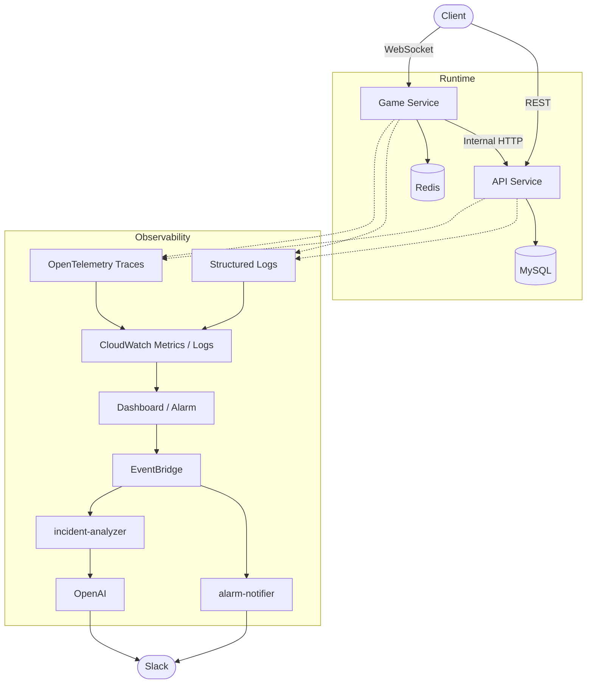
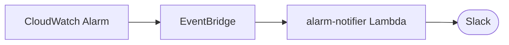
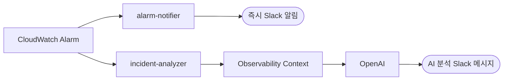

# 실시간 멀티플레이 음악 퀴즈 서비스

> 실시간 게임 서비스의 개발부터 배포, 운영 관측, AI 기반 장애 분석까지 직접 구축한 개인 프로젝트


---

## 목차

- [프로젝트 개요](#프로젝트-개요)
- [전체 아키텍처](#전체-아키텍처)
- [Part 1. 서비스 구조 설계](#part-1-서비스-구조-설계)
    - [1. 실시간 게임 서버 분리](#1-실시간-게임-서버-분리)
    - [2. Redis를 활용한 실시간 게임 상태 관리](#2-redis를-활용한-실시간-게임-상태-관리)
    - [3. Terraform 기반 AWS 인프라 구축](#3-terraform-기반-aws-인프라-구축)
    - [4. API / Game 독립 배포 구조](#4-api--game-독립-배포-구조)
- [Part 2. Observability 구축](#part-2-observability-구축)
    - [5. Structured Logging과 Request Correlation](#5-structured-logging과-request-correlation)
    - [6. CloudWatch 기반 Observability](#6-cloudwatch-기반-observability)
    - [7. CloudWatch Dashboard](#7-cloudwatch-dashboard)
    - [8. OpenTelemetry 기반 Distributed Tracing](#8-opentelemetry-기반-distributed-tracing)
- [Part 3. 장애 알림과 AI 기반 분석](#part-3-장애-알림과-ai-기반-분석)
    - [9. CloudWatch Alarm → Slack 장애 알림](#9-cloudwatch-alarm--slack-장애-알림)
    - [10. AI 기반 Incident Analysis](#10-ai-기반-incident-analysis)
    - [11. AI에게 Raw Data를 전달하지 않는 Context Collector](#11-ai에게-raw-data를-전달하지-않는-context-collector)
    - [12. Metrics / Logs / Traces를 함께 이용한 장애 분석](#12-metrics--logs--traces를-함께-이용한-장애-분석)
    - [13. 최근 Production Deployment / PR Context](#13-최근-production-deployment--pr-context)
    - [14. 최근 PR을 무조건 장애 원인으로 판단하지 않도록 설계](#14-최근-pr을-무조건-장애-원인으로-판단하지-않도록-설계)
    - [15. AI Structured Output](#15-ai-structured-output)
    - [16. 실제 AI Incident Analysis 예](#16-실제-ai-incident-analysis-예)
    - [17. Game Target 5xx AIOps 확장](#17-game-target-5xx-aiops-확장)
- [주요 기술적 의사결정](#주요-기술적-의사결정)
- [프로젝트를 통해 집중한 부분](#프로젝트를-통해-집중한-부분)

---

## 프로젝트 개요

실시간으로 여러 사용자가 방에 참여해 음악을 듣고 정답을 맞히는 멀티플레이 음악 퀴즈 서비스입니다.

기능 구현 자체에 그치지 않고 **실제 서비스를 운영한다는 관점**에서 프로젝트를 발전시키며 다음을 직접 설계하고 구축했습니다.

| 영역 | 구축 내용 |
|---|---|
| 서비스 구조 | API와 실시간 Game 서버의 서비스 분리 |
| 실시간 처리 | Redis 기반 실시간 게임 상태 및 동시성 제어 |
| 인프라 | Terraform 기반 AWS Infrastructure as Code |
| 배포 | GitHub Actions 기반 CI/CD |
| 로깅 | Structured Logging 및 요청 추적 |
| 관측 | CloudWatch Metrics / Dashboard / Alarm |
| 추적 | OpenTelemetry 기반 Distributed Tracing |
| 알림 | Slack 장애 알림 |
| AIOps | Metrics / Logs / Traces / 최근 배포 이력을 활용한 AI 장애 분석 |

### Tech Stack

| 구분 | 사용 기술 |
|---|---|
| Backend | `NestJS` `TypeScript` `Socket.IO` |
| Frontend | `React` |
| Data | `MySQL` `Redis` |
| Infra | `AWS ECS Fargate` `ECR` `RDS` `ElastiCache` `ALB` `CloudFront` `S3` |
| IaC / CI | `Terraform` `GitHub Actions` |
| Observability | `OpenTelemetry` `CloudWatch` `X-Ray` |
| AI | `OpenAI API` |

---

## 전체 아키텍처



---

## Part 1. 서비스 구조 설계

### 1. 실시간 게임 서버 분리

초기에는 일반 API와 실시간 게임 로직이 하나의 NestJS 애플리케이션 안에 존재했습니다.
게임 기능이 커지면서 다음 책임이 일반 API와 크게 달라졌습니다.

```text
REST API                Game Server
├─ 사용자               ├─ Socket.IO
├─ 노래/퀴즈 데이터     ├─ Room 상태
├─ 관리 기능            ├─ 게임 Timer
└─ DB 중심 처리         ├─ Redis Lock
                        ├─ Reconnect
                        └─ 실시간 Broadcast
```

이에 따라 실시간 게임 영역을 독립적인 `Game Service`로 분리했습니다.

```text
Client
  │
  ├──────────── REST ────────────→ API Service
  │
  └────────── WebSocket ─────────→ Game Service
                                      │
                                      ├─ Redis
                                      │
                                      └─ Internal HTTP
                                             ↓
                                         API Service
                                             ↓
                                            MySQL
```

Game Service가 API Service의 Entity나 Repository를 직접 참조하지 않도록 경계를 설정하고, 게임 시작 시 필요한 데이터를 API로부터 **Snapshot 형태로 전달**받도록 구성했습니다.

이를 통해 서비스 간 책임을 명확하게 분리했습니다. 초기에는 트래픽 규모가 크지 않아 API와 Game 프로세스를 하나의 EC2에 함께 운영해 인프라 비용을 최소화했지만, 이후 두 서비스를 각각 독립적으로 스케일링/배포할 수 있도록 컴퓨트 계층까지 ECS Fargate로 전환했습니다(Part 1-4 참고).

### 2. Redis를 활용한 실시간 게임 상태 관리

실시간 게임에서는 여러 사용자의 요청이 동시에 발생하기 때문에 단순 DB 중심 설계보다 빠른 상태 공유와 동시성 제어가 필요했습니다.

Redis를 다음 영역에 활용했습니다.

- Room State
- Game Progress
- Timer
- Distributed Lock
- Reconnect State
- Socket.IO Redis Adapter

특히 게임 진행 과정에서 중복 처리 가능성이 있는 작업은 **Redis Lock 및 claim 구조**를 사용하여 여러 요청이 동시에 들어오더라도 하나의 프로세스만 처리할 수 있도록 설계했습니다.

Redis를 모든 데이터의 저장소로 사용하지 않고, 영속성이 필요한 데이터는 MySQL, 실시간 상태와 동시성 제어는 Redis가 담당하도록 역할을 구분했습니다.

### 3. Terraform 기반 AWS 인프라 구축

서비스 인프라는 Terraform으로 관리했습니다.

```text
infra/terraform/
├─ environments/
│  ├─ bootstrap
│  └─ prod
└─ modules/
   ├─ network
   ├─ security
   ├─ logging
   ├─ iam
   ├─ compute
   ├─ load_balancer
   ├─ acm
   ├─ web
   ├─ dns
   ├─ ses
   ├─ database
   ├─ cache
   ├─ ecr
   ├─ ecs
   ├─ monitoring
   ├─ notification
   ├─ aiops
   ├─ finops
   └─ cost-reporter
```

VPC, ECS Fargate, ECR, ALB, RDS, ElastiCache, CloudFront, IAM, CloudWatch 등의 주요 AWS 리소스를 코드로 관리하고 있습니다.

Terraform State는 S3 Remote State로 관리하고 GitHub Actions에서 OIDC를 이용해 `terraform plan`을 수행하도록 구성했습니다.

> 장기 Access Key를 CI에 저장하지 않고 GitHub OIDC와 최소 권한 IAM Role을 사용했습니다.

### 4. API / Game 독립 배포 구조, EC2 → ECS Fargate 전환

API와 Game은 애플리케이션 레벨에서는 처음부터 독립적인 서비스로 구성했습니다.

`Process` · `Domain / Routing` · `Target Group` · `Health Check` · `Deployment` · `Logging`

컴퓨트 계층은 초기에는 비용 절감을 위해 두 서비스를 동일 EC2에서 함께 운영했지만, 이후 서비스별로 독립적인 배포/스케일링 단위를 갖도록 ECS Fargate로 전환했습니다.

기존 EC2 Target Group을 그대로 ECS용으로 바꾸지 않고, ECS 전용 Target Group을 새로 만들어 두 Target Group을 한동안 병행 운영했습니다.

```text
ALB
├─ app TG(instance)      → EC2 API   (rollback 대비 병행 유지)
├─ api-ecs TG(ip)        → ECS API
├─ game TG(instance)     → EC2 Game  (rollback 대비 병행 유지)
└─ game-ecs TG(ip)       → ECS Game
```

Listener(Rule)의 forward weight만 EC2 0% / ECS 100%로 바꾸면 트래픽 전환이 순간적인 in-place 업데이트가 되고, 문제가 생기면 weight를 되돌리는 것만으로 즉시 롤백할 수 있습니다. API → Game 순서로 단계적으로 전환했고, 지금은 두 서비스 모두 트래픽의 100%가 ECS Fargate로 서비스되고 있습니다.

ECS Task는 NAT Gateway 없이 public subnet + public IP로 아웃바운드(ECR pull, CloudWatch Logs 등)를 확보하면서, inbound는 Security Group으로 ALB에서만 허용해 컨테이너 포트가 인터넷에 직접 노출되지 않도록 구성했습니다. 트래픽 전환이 끝난 뒤에는 NAT Gateway를 사용하는 workload가 더 이상 없음을 확인하고 NAT Gateway/EIP도 제거해 고정 네트워크 비용을 줄였습니다.

각 서비스의 ECS Task Definition/Service에는 Application Auto Scaling(CPU/Memory Target Tracking)을 붙여, 부하에 따라 Task 수가 자동으로 조정되도록 했습니다.

배포도 함께 바뀌었습니다.

```text
GitHub Actions → OIDC AssumeRole → Docker build → ECR push(commit SHA 태그)
→ ECS Task Definition 리비전 등록 → ECS Service 갱신 → deployment stable 확인
```

Image tag는 `latest`가 아니라 Git commit SHA를 기본으로 사용해서, 어떤 Task Definition revision이 실제로 어느 커밋을 배포한 것인지 항상 추적할 수 있게 했습니다.

---

## Part 2. Observability 구축

### 5. Structured Logging과 Request Correlation

운영 중 장애가 발생했을 때 단순 문자열 로그만으로는 하나의 요청 흐름을 추적하기 어렵기 때문에 공통 Logger Package를 구성했습니다.

Production에서는 JSON 형태의 Structured Log를 출력하고 모든 요청에 `requestId`를 부여했습니다.

```text
Client
 ↓
API / Game        requestId 생성
 ↓
Internal HTTP     X-Request-Id 전달
 ↓
다른 Service      동일 requestId
```

Game → API 내부 호출에서도 requestId를 전달하기 때문에 CloudWatch Logs에서 하나의 요청 흐름을 서비스 간 연결해 확인할 수 있습니다.

비밀번호, Authorization, Cookie 등의 민감정보는 로그에 포함되지 않도록 **redaction**을 적용했습니다.

### 6. CloudWatch 기반 Observability

서버가 정상적으로 실행되는지만 확인하는 수준에서 벗어나 운영 상태를 빠르게 파악할 수 있도록 Observability를 단계적으로 구축했습니다.

#### Infrastructure Metrics

```text
ECS(API/Game)      RDS                          Redis
├─ CPU             ├─ CPU                       ├─ Memory Usage
└─ Memory          └─ Database Connections      ├─ Connections
                                                 └─ Evictions
```

두 서비스 모두 ECS Fargate로 전환한 뒤에는 `AWS/ECS`의 Service CPU/MemoryUtilization을 자원 지표로 사용합니다(EC2 시절에는 CloudWatch Agent로 EC2 Memory/Disk까지 Custom Metric으로 수집했습니다).

#### Application Metrics

게임 도메인에서 실제 장애 판단에 의미 있는 이벤트를 Metric Filter로 만들었습니다.

- `QuizSnapshotFailure`
- `RedisLockFailure`
- `TimerClaimFailure`

단순 서버 자원뿐 아니라 **애플리케이션의 실제 실패 이벤트를 운영 Metric으로 노출**하는 것을 목표로 했습니다.

### 7. CloudWatch Dashboard

운영 상태를 한 화면에서 확인할 수 있도록 Production Dashboard를 Terraform으로 구성했습니다.

```text
API / Game Traffic          ECS API/Game CPU / Memory
API / Game Latency          RDS CPU / Connections
API / Game 5xx              Redis Memory / Connections / Evictions

Game Application Failures
```

이를 통해 장애가 발생했을 때 로그부터 찾기보다 **먼저 서비스 전체 상태와 영향 범위를 확인**할 수 있도록 했습니다.

### 8. OpenTelemetry 기반 Distributed Tracing

Metrics와 Logs만으로는 서비스 간 호출에서 어느 구간이 느린지 파악하기 어려워 OpenTelemetry를 도입했습니다.

공통 `packages/tracing`을 구성하고 API와 Game에 Auto Instrumentation을 적용했습니다.

```text
Game  →  HTTP / undici  →  API  →  mysql2
```

Game → API 호출에는 W3C `traceparent`를 사용하여 Trace Context를 전파합니다.

API는 다음 경로로 Trace를 AWS에 전달합니다.

```text
API  →  OTLP/HTTP(localhost)  →  aws-otel-collector 사이드카(같은 ECS Task)  →  AWS X-Ray / CloudWatch Traces
```

EC2였을 때는 host-level CloudWatch Agent가 이 역할을 했지만, ECS Fargate는 host-level agent를 둘 수 없어 같은 Task 안에 Collector 컨테이너를 사이드카로 띄우는 방식으로 바꿨습니다. Game은 아직 이 사이드카를 두지 않아 Trace Export가 비활성 상태입니다 — Game ECS 전환은 최소 관측(Logs/Metric/Alarm)까지만 먼저 마쳤고, 트레이싱은 후속 작업으로 남겨뒀습니다.

Structured Log에서도 현재 OpenTelemetry Span의 `traceId`를 기록하여

```text
Metric  →  Trace  →  traceId  →  CloudWatch Log
```

형태로 장애를 단계적으로 추적할 수 있도록 구성했습니다.

---

## Part 3. 장애 알림과 AI 기반 분석

### 9. CloudWatch Alarm → Slack 장애 알림

운영자가 Dashboard를 계속 보고 있을 수 없기 때문에 주요 장애 조건에 CloudWatch Alarm을 구성했습니다.

**대표 Alarm**

```text
API / Game Unhealthy Host      ECS API/Game High CPU
API / Game No Healthy Hosts    ECS API/Game High Memory
API / Game Target 5xx          QuizSnapshotFailure
```

Alarm 상태 변화는 다음 구조로 Slack에 전달합니다.



`ALARM`뿐 아니라 `OK` 상태도 전달하여 장애 발생과 복구를 함께 확인할 수 있도록 했습니다.

`QuizSnapshotFailure`는 `ALARM → OK` 전환 시 곧바로 복구 알림을 보내지 않고, 최근 일정 시간 동안 실제 게임 시작이 일정 횟수 이상 성공했는지 `GameStartSuccess` Custom Metric으로 재확인한 뒤에만 Slack에 복구 알림을 보내도록 했습니다. CloudWatch 알람 자체는 조건 충족 시 바로 `OK`로 바뀌지만, 지표상 `OK`와 실제 게임 진행 가능 여부가 다를 수 있다는 점을 고려해 Slack 알림 시점만 별도로 검증합니다. 지표 조회 자체가 실패하면 fail-open으로 기존처럼 즉시 복구 알림을 보냅니다.

> Slack Webhook은 SSM Parameter Store SecureString으로 관리하고 Lambda에는 해당 Parameter를 조회할 최소 권한만 부여했습니다.

### 10. AI 기반 Incident Analysis

단순히 장애가 발생했다는 사실만 알려주는 것을 넘어 **"왜 장애가 발생했을 가능성이 높은가"를 자동으로 분석하는 AIOps 구조**를 구축했습니다.

기존 즉시 알림과 AI 분석을 분리했습니다.



AI 분석이 실패하거나 늦어져도 기존 장애 알림에는 영향을 주지 않습니다.

### 11. AI에게 Raw Data를 전달하지 않는 Context Collector

CloudWatch와 X-Ray에서 가져온 전체 데이터를 그대로 AI에 전달하지 않고 먼저 정규화합니다.

```text
AWS Raw Data
├─ CloudWatch Metrics
├─ CloudWatch Logs
├─ X-Ray Trace
└─ Alarm Definition
        ↓
Context Collector
        ↓
 IncidentContext
        ↓
      OpenAI
```

Metric은 다음 형태로 요약합니다.

```json
{
  "name": "Game.QuizSnapshotFailure",
  "current": 2,
  "average15m": 0.2,
  "max15m": 2,
  "trend": "increasing",
  "dataState": "OBSERVED"
}
```

Metric 데이터가 없을 경우도 단순 `null`이 아니라 다음 상태를 구분합니다.

| dataState | 의미 |
|---|---|
| `OBSERVED` | 정상적으로 관측된 값 |
| `NO_DATAPOINT` | 조회는 성공했으나 데이터 없음 |
| `COLLECTION_FAILED` | 수집 자체가 실패 |

또한 이벤트가 발생할 때만 생성되는 **Sparse Count Metric**과 일반 **Gauge Metric**을 구분해 AI가 `데이터 없음`을 잘못 해석하지 않도록 했습니다.

### 12. Metrics / Logs / Traces를 함께 이용한 장애 분석

현재 `QuizSnapshotFailure`에서는 다음 Context를 함께 사용합니다.

```text
Alarm Definition

Metrics                      Logs                    Trace
├─ QuizSnapshotFailure       ├─ error count          └─ 관련 traceId가 존재할 경우
├─ API / Game 5xx            ├─ event count             X-Ray 조회
├─ API / Game Latency        ├─ errorCode count
└─ RDS 상태                  └─ 대표 error log
```

Collector 일부가 실패해도 전체 분석을 중단하지 않습니다.

```text
Metrics [OK]
Logs    [OK]
Trace   [FAIL]

→ Metrics + Logs 기반 분석 계속
```

단 충분한 Context가 전혀 없는 경우에는 불필요한 OpenAI 호출을 하지 않습니다.

### 13. 최근 Production Deployment / PR Context

장애가 최근 코드 변경과 관련됐는지도 분석할 수 있도록 Production Deployment Metadata를 함께 수집합니다.

중요한 점은 GitHub의 최신 PR을 사용하는 것이 아니라 **실제로 Production에 배포된 commit**을 기준으로 한다는 것입니다.

```text
GitHub Actions
      ↓
Production Deployment
      ↓
서버에서 실제 HEAD 확인 (git rev-parse HEAD)
      ↓
commit → associated PR 조회
      ↓
SSM Parameter Store
```

저장 정보 예:

```json
{
  "service": "api",
  "commitSha": "...",
  "deployedAt": "...",
  "pullRequestLookup": "FOUND",
  "pullRequest": {
    "number": 87,
    "title": "...",
    "changedFiles": []
  }
}
```

Incident Analyzer는 API/Game의 최근 Production Deployment를 읽어 장애 발생 시점과의 시간 차이를 계산합니다.

### 14. 최근 PR을 무조건 장애 원인으로 판단하지 않도록 설계

최근 배포 정보는 **보조 근거**로만 사용하도록 OpenAI Prompt에 명시했습니다.

예를 들어 실제 장애 테스트에서 최근 배포가 존재했지만 변경 내용이 CI Workflow 수정이었다면 AI는 다음처럼 판단했습니다.

```text
Recent Deployment
API  · 69분 전
Game · 67분 전

PR
fix(ci): deployment metadata 기록 수정

Deployment Correlation
LOW
```

> 최근 배포는 있었지만 변경 파일이 배포 Workflow이고 현재 런타임 Timeout과 직접적인 기술적 연관성이 없어 원인 후보로 보기 어렵다.

단순히 최근 PR이 존재한다는 이유로 장애 원인으로 연결하지 않도록 **시간, 변경 파일, Metrics, Logs, Traces를 함께 고려**하도록 구성했습니다.

### 15. AI Structured Output

AI 응답은 자유 형식 문자열이 아니라 Structured Output으로 받습니다.

```json
{
  "summary": "...",
  "probableCause": "...",
  "confidence": "HIGH",
  "evidence": [],
  "recommendedChecks": [],
  "limitations": [],
  "deploymentCorrelation": {
    "relevance": "LOW",
    "summary": "..."
  }
}
```

이를 다시 Lambda에서 Slack Block Kit으로 변환합니다.
AI가 Slack payload 자체를 생성하게 하지 않아 결과 포맷을 일정하게 유지했습니다.

### 16. 실제 AI Incident Analysis 예

실제 `QuizSnapshotFailure` 이벤트를 발생시킨 결과 다음과 같은 분석을 받을 수 있었습니다.

```text
AI INCIDENT ANALYSIS

Summary
QuizSnapshotFailure Alarm 조건이 충족되었습니다.

Probable Cause
Game의 Quiz Snapshot 조회 과정에서 실패가 발생한 것이
직접 원인으로 관측됩니다.

Evidence
• Alarm 평가 구간에서 QuizSnapshotFailure 2건
• QUIZ_ROUNDS_FETCH_FAILED 2건
• 관련 Error Log 존재
• RDS CPU / Connection은 정상 범위

Confidence          Recent Deployment        Deployment Correlation
HIGH                API  · 69분 전            LOW
                    Game · 67분 전
```

확인되지 않은 하위 원인은 단정하지 않고 `limitations`에 명시하도록 했습니다.

### 17. Game Target 5xx AIOps 확장

첫 번째 vertical slice가 동작한 뒤 동일한 Incident Analyzer를 `Game Target5xx`까지 확장했습니다.
새 Lambda를 복제하지 않고 작은 `IncidentType` 분기로 처리합니다.

```ts
type IncidentType =
  | 'QUIZ_SNAPSHOT_FAILURE'
  | 'GAME_TARGET_5XX';
```

Game Target5xx에서는 다음 Context를 함께 분석하도록 구성했습니다.

```text
Game                  API                   Game Application
├─ 5xx                ├─ 5xx                ├─ QuizSnapshotFailure
├─ Latency            ├─ Latency            ├─ RedisLockFailure
└─ Request Count      └─ Request Count      └─ TimerClaimFailure

Infrastructure
├─ EC2 CPU / Memory
├─ Redis Memory / Connection / Evictions
└─ RDS CPU / Connections

+ Game Error Logs   + 관련 Trace   + Game/API Deployment PR
```

이를 통해 `Game 자체 오류` · `API dependency 문제` · `Redis/Lock 문제` · `Resource pressure` · `최근 배포 영향` 등의 가능성을 관측 데이터 기반으로 비교할 수 있도록 확장했습니다.

> Game Target5xx 코드는 구현 · Terraform Apply · 실제 장애 상황에서의 실데이터 분석 검증까지 모두 완료했습니다.

---

## 주요 기술적 의사결정

| 문제 | 선택 | 이유 |
|---|---|---|
| API / 실시간 게임 결합 | API / Game 분리 | 서로 다른 상태/트래픽/책임 분리 |
| 서비스 간 데이터 접근 | Internal HTTP Snapshot | Repository 직접 공유 방지 |
| 실시간 상태 | Redis | 빠른 상태 공유 및 동시성 제어 |
| 서버 배치 | 동일 EC2 → ECS Fargate | 초기엔 비용 최소화, 이후 독립 스케일링/배포로 전환 |
| 컨테이너 아웃바운드 | Public Subnet + Public IP | NAT Gateway 없이 ECR/CloudWatch Logs 접근, inbound는 SG로 ALB만 허용 |
| 트래픽 컷오버 | ALB weighted forward | 기존/신규 Target Group 병행, weight 조정만으로 즉시 롤백 가능 |
| Auto Scaling | ECS Target Tracking(CPU/Memory) | 단순한 v1로 시작, custom metric은 관찰 후 검토 |
| Infrastructure | Terraform | 재현 가능한 AWS 구성 |
| Trace | OpenTelemetry | Vendor-neutral instrumentation |
| Trace Export(API) | aws-otel-collector 사이드카 → X-Ray | ECS Fargate에는 host-level agent가 없어 같은 Task에 Collector를 둠 |
| 알림 | EventBridge → Lambda → Slack | 향후 AIOps 확장 가능 |
| AI 분석 | 별도 Incident Analyzer | 기본 장애 알림과 AI 실패 격리 |
| AI 입력 | 정규화된 IncidentContext | 비용·노이즈·Hallucination 감소 |
| 배포 정보 | 실제 Production HEAD | GitHub 최신 PR과 실제 배포 상태 혼동 방지 |
| 자동조치 | 미적용 | AIOps v1에서는 Read-only 분석 우선 |

---

## 프로젝트를 통해 집중한 부분

이 프로젝트에서는 기능 구현 자체보다 **실제 서비스를 운영할 때 필요한 구조를 직접 경험하는 것**에 집중했습니다.

처음부터 MSA나 AIOps를 목표로 복잡한 구조를 만든 것이 아니라, 프로젝트가 발전함에 따라 필요성을 확인하고 단계적으로 구조를 확장했습니다.

```text
실시간 게임 구현
  → API / Game 책임 분리
    → Terraform 기반 Infrastructure 관리
      → Structured Logging
        → Metrics / Dashboard
          → Distributed Tracing
            → Alarm / Slack Notification
              → AI Incident Analysis
                → Deployment / PR Correlation
```

각 단계에서 현재 트래픽과 비용을 고려해 필요한 만큼만 도입하고, Kafka나 자동 복구와 같이 현재 규모에서 불필요한 기술은 **의도적으로 미뤘습니다**.

향후에는 Game/API 5xx 등으로 Incident Policy를 확장하고, 분석 결과에 맞는 Runbook 추천과 사람의 승인을 거치는 안전한 운영 자동화까지 발전시킬 계획입니다.