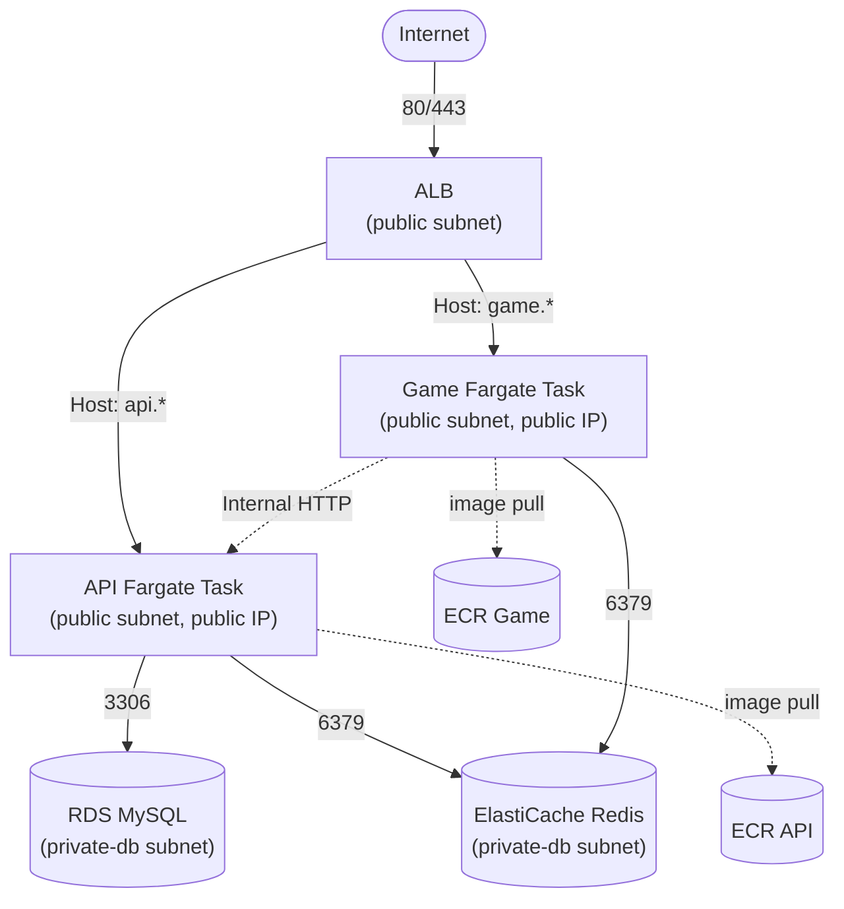

# 비용 절감을 위한 ECS Fargate 이관 계획

- 상태: Draft (단계 1 착수 전)
- 범위: `apps/api`, `apps/game`의 컴퓨트 계층을 EC2(`app_a`) 단일 인스턴스에서 ECR + ECS Fargate로 전환한다. RDS/ElastiCache/S3+CloudFront(web)/SES/DNS는 이번 이관 범위 밖이며 그대로 둔다(RDS/ElastiCache는 private subnet 유지).
- 관련 코드/설정: `infra/terraform/modules/{network,security,compute,load_balancer,iam,logging,monitoring,database,cache}`, `.github/workflows/deploy-api.yml`, `.github/workflows/deploy-game.yml`, [`ARCHITECTURE.md`](../../ARCHITECTURE.md) Observability 섹션

## 배경

현재 `apps/api`와 `apps/game`은 같은 EC2 인스턴스(`app_a`, private-app 서브넷)에서 PM2로 각각 다른 포트에 실행되고, ALB가 Host 헤더 기준으로 두 Target Group(`app`/`game`)에 나눠 전달한다. [ADR-0004](../adr/0004-game-service-split.md)에서 두 서비스는 코드/배포 단위(프로세스)로는 이미 분리했지만, 인프라(컴퓨트) 단위에서는 여전히 하나의 EC2 인스턴스를 공유한다.

이 구조에서는 한쪽 서비스의 부하가 증가해도 인스턴스 전체를 함께 확장해야 하고, API/Game 배포 역시 동일 서버를 공유하므로 서로 완전히 독립적인 컴퓨트/배포 단위를 갖지 못한다.

private-app 서브넷의 `app_a`는 인터넷 아웃바운드를 위해 NAT Gateway(`infra/terraform/modules/network`)를 사용한다. NAT Gateway는 이 프로젝트에서 고정적으로 발생하는 네트워크 비용 중 하나다.

API/Game을 Fargate Task로 전환하고 Task를 public subnet + public IP 구조로 배치하면 Internet Gateway를 통해 직접 인터넷 아웃바운드가 가능하므로, `app_a` 및 NAT를 사용하는 다른 private workload가 모두 제거된 이후 NAT Gateway를 제거할 수 있다.

Inbound는 여전히 Security Group으로 ALB에서만 허용하므로, Task에 public IP가 할당되더라도 API/Game container port가 인터넷에 직접 노출되지는 않는다.

단, NAT 제거는 ECS 이관과 같은 변경에서 바로 수행하지 않고, API/Game 이관 완료 후 private subnet에서 NAT를 사용하는 workload가 더 이상 없는지 확인한 뒤 별도 Terraform 변경으로 진행한다.

## 목표 아키텍처



- ALB는 지금과 동일하게 public subnet + 기존 `security.public` SG를 사용한다.
- Host 헤더 기반 라우팅 구조 역시 유지한다.
- 기존 EC2용 Target Group을 `instance → ip`로 직접 변경하지 않는다.
- ECS API/Game용 `target_type = "ip"` Target Group을 각각 새로 만들고, 기존 EC2 Target Group은 이관/롤백 기간 동안 병행 유지한다.
- API/Game Task는 각각 public subnet에 배치하고 `assign_public_ip = true`를 사용한다.
- Task SG의 container port inbound는 ALB SG에서만 허용한다.
- RDS/Redis는 현재와 동일하게 private-db subnet에 유지한다.
- Game은 RDS에 직접 접근하지 않고 기존 구조대로 API Internal HTTP를 통해 Quiz Snapshot 등의 데이터를 가져온다.
- Game의 실시간 room state/lock/timer 관련 공유 상태는 Redis를 사용한다.

## 보안 그룹 설계

기존에는 API/Game이 같은 EC2 인스턴스를 공유해 `app` SG 하나를 사용했지만, ECS 전환 이후에는 API/Game을 별도 SG로 분리한다.

| SG | Inbound | 비고 |
|---|---|---|
| `alb` (기존 `public`) | 80/443 ← `0.0.0.0/0` | 변경 없음 |
| `ecs_api` (신규) | API container port ← `alb` SG | 인터넷 직접 접근 불가 |
| `ecs_game` (신규) | Game container port ← `alb` SG | 인터넷 직접 접근 불가 |
| `db` (기존) | 3306 ← 기존 `app` SG + `ecs_api` SG | API 이관 기간에는 EC2용 `app` SG 유지 |
| `cache` (기존) | 6379 ← 기존 `app` SG + `ecs_api` SG + `ecs_game` SG | 단계적으로 ECS SG 추가 |
| `bastion` (기존) | 22 ← 현재 설정 유지 | RDS/Redis 관리 접근 때문에 당장은 유지 |

- `ecs_api`/`ecs_game` SG에는 SSH inbound를 만들지 않는다.
- `0.0.0.0/0 → API/Game container port` 규칙은 만들지 않는다.
- public IP는 인터넷 아웃바운드를 위한 것이며 inbound 접근 제어는 SG에서 ALB로 제한한다.
- API/Game을 별도 SG로 두어 서비스별 네트워크 권한을 독립적으로 관리한다.
- 단계적 이관 중에는 기존 `app` SG를 즉시 제거하지 않는다.
    - API ECS 이관 후에도 Game EC2가 `app` SG를 계속 사용한다.
    - Game ECS 이관 및 EC2 제거가 끝난 이후 기존 `app` SG 제거를 검토한다.
- RDS는 Game에서 직접 접근하지 않으므로 최종 구조에서는 `ecs_api` SG만 DB inbound source로 남기는 것을 기본으로 한다.
- Redis는 API/Game 모두 사용하므로 최종적으로 `ecs_api`, `ecs_game` SG를 허용한다.

## Terraform 모듈 변경 범위

| 모듈 | 변경 |
|---|---|
| `modules/ecr` (신규) | API/Game ECR repository 2개 생성, image scanning 및 오래된 image 정리 lifecycle policy 구성 |
| `modules/ecs` (신규) | ECS Cluster, API/Game Task Definition, Service 구성. Auto Scaling은 마지막 단계에서 별도 추가 |
| `modules/iam` | ECS Task Execution Role(ECR pull, awslogs, secret 주입) + Task Role(API/Game runtime AWS 권한) 추가 |
| `modules/security` | 기존 `app` SG는 이관 기간 동안 유지하고 `ecs_api`/`ecs_game` SG 신규 추가 |
| `modules/load_balancer` | 기존 EC2 `app`/`game` Target Group 유지 + ECS용 `api_ecs`/`game_ecs` `target_type = "ip"` Target Group 신규 생성. ECS Service가 `load_balancer` 블록으로 Task를 Target Group에 등록하도록 구성 |
| `modules/database` | 이관 단계에 따라 `ecs_api_security_group_id`를 DB inbound source에 추가. 기존 `app` SG는 EC2 API/Game이 완전히 제거될 때까지 필요에 따라 유지 |
| `modules/cache` | `ecs_api_security_group_id`/`ecs_game_security_group_id`를 Redis inbound source에 단계적으로 추가 |
| `modules/logging` | 기존 API/Game Log Group을 가능하면 그대로 재사용하고 ECS `awslogs` driver가 stdout/stderr를 직접 전송하도록 변경 |
| `modules/monitoring` | API ECS 전환 시 API 관련 ECS Service metric 및 신규 API ECS Target Group metric 추가. Game EC2 metric은 Game ECS 전환 전까지 유지하고 이후 ECS 기준으로 교체 |
| `modules/compute` | Game ECS 전환 및 안정화 이후 `app_a` EC2 제거. `bastion`은 별도 필요성 검토 전까지 유지 |
| `modules/network` | `app_a` 제거 후 NAT를 사용하는 private workload가 없는지 확인한 뒤 NAT Gateway/EIP/private-app route 제거를 별도 변경으로 진행 |
| `environments/bootstrap` | GitHub Actions용 ECR push/ECS deploy OIDC IAM Role 추가 |
| `environments/prod` | ECR/ECS/security/load balancer 관련 신규 모듈 및 resource wiring 추가 |

## ECS IAM 역할

ECS에서는 기존 EC2 Instance Role 하나가 담당하던 권한을 Task Execution Role과 Task Role로 구분한다.

### Task Execution Role

ECS Agent/Fargate가 Task 실행을 위해 사용하는 권한이다.

- ECR image pull
- CloudWatch Logs 전송
- Task Definition `secrets`에 설정된 SSM Parameter / Secrets Manager 값 조회
- 필요 시 KMS decrypt

애플리케이션 코드에서는 이 Role을 직접 사용하지 않는다.

### Task Role

실행 중인 API/Game 애플리케이션 코드가 사용하는 AWS 권한이다.

예:

- API SES 발신
- 향후 애플리케이션이 직접 사용하는 AWS 서비스 접근

`ce:*`, `ssm:*` 등의 광범위 권한을 사용하지 않고 서비스별 최소 권한을 부여한다.

## 환경변수 / Secret 관리

현재 EC2에 설정된 API/Game 환경변수를 ECS Task Definition으로 이전한다.

일반 설정값은 Task Definition `environment`를 사용할 수 있다.

예:

```text
NODE_ENV
PORT
GAME_API_URL
REDIS_HOST
COMMIT_SHA
```

민감정보는 Task Definition에 plaintext로 직접 작성하지 않는다.

예:

```text
DB_PASSWORD
JWT_SECRET
OPENAI_API_KEY
기타 외부 서비스 secret
```

민감정보는 SSM Parameter Store `SecureString` 또는 Secrets Manager를 사용하고 Task Definition의 `secrets`로 주입한다.

Docker image에도 `.env` 파일이나 secret을 포함하지 않는다.

## Target Group / 트래픽 전환 전략

기존 EC2 Target Group을 ECS용으로 직접 변경하지 않는다.

이관 중에는 다음 구조를 병행한다.

```text
기존

ALB
 ├─ app TG(instance)  → EC2 API
 └─ game TG(instance) → EC2 Game
```

API ECS 이관 시:

```text
ALB
 ├─ app TG(instance)     → EC2 API
 ├─ api-ecs TG(ip)       → ECS API
 └─ game TG(instance)    → EC2 Game
```

Game ECS 이관 시:

```text
ALB
 ├─ app TG(instance)      → EC2 API (rollback 기간)
 ├─ api-ecs TG(ip)        → ECS API
 ├─ game TG(instance)     → EC2 Game (rollback 기간)
 └─ game-ecs TG(ip)       → ECS Game
```

트래픽 전환은 Listener/Listener Rule의 forward 대상만 변경한다.

필요하면 API 전환 시 ALB weighted forwarding으로 점진적인 canary를 사용할 수 있다.

예:

```text
EC2 90 / ECS 10
→ EC2 50 / ECS 50
→ ECS 100
```

전환 직후에는 기존 EC2 프로세스를 즉시 종료하지 않고 emergency rollback 용도로 잠시 유지한다.

단, ECS 전환 이후 신규 API/Game 코드가 계속 배포되면 EC2 버전과 ECS 버전이 달라질 수 있으므로 장기 rollback은 이전 ECS Task Definition/Image revision을 사용하는 것을 기본으로 한다.

## Health Check 전략

현재 `/health`, `/ready` endpoint를 ECS에서도 유지한다.

- ECS container health check
    - `/health`
    - Node/NestJS 프로세스 자체가 정상 실행되는지 확인
- ALB Target Group health check
    - `/ready`
    - 실제 요청을 받을 준비가 되었는지 확인
    - API의 경우 DB/Redis dependency 상태 포함
    - Game의 경우 Redis readiness 기준 유지

ECS Service에는 적절한 `health_check_grace_period_seconds`를 설정해서 Task 시작 직후 dependency 초기화 시간 때문에 반복적으로 Task가 종료되지 않도록 한다.

## 배포 구조 변경

현재:

```text
GitHub Actions
→ Bastion SSH
→ app_a SSH
→ git pull
→ yarn build
→ PM2 reload
→ /ready 확인
```

ECS 전환 후:

```text
GitHub Actions
→ OIDC AssumeRole
→ Docker build
→ ECR push (commit SHA tag)
→ ECS Task Definition revision
→ ECS Service update
→ deployment stable / readiness 확인
→ deployment metadata 기록
```

Image tag는 `latest`에 의존하지 않고 Git commit SHA를 기본으로 사용한다.

예:

```text
song-quiz-api:a83f921
song-quiz-game:a83f921
```

이를 통해 ECS Task Definition revision에서 실제 배포 commit과 image를 추적하고 rollback할 수 있게 한다.

## Observability 변경

EC2에서는 현재 다음 흐름을 사용한다.

```text
Node/PM2
→ 파일 로그
→ CloudWatch Agent
→ CloudWatch Logs
```

ECS에서는 다음으로 변경한다.

```text
Node
→ stdout/stderr
→ ECS awslogs driver
→ CloudWatch Logs
```

기존 `packages/logger`의 JSON logging 구조는 가능한 한 그대로 유지한다.

API/Game Log Group도 가능하면 기존 것을 재사용해서 AIOps/Logs Insights query 변경을 최소화한다.

단, ECS log stream 이름은 기존 PM2/CloudWatch Agent와 달라지므로 log stream 이름 자체를 기준으로 필터링하는 코드나 쿼리가 없는지 확인한다.

ECS 전환 시 서비스별 runtime metric은 단계적으로 변경한다.

API ECS 전환 후:

```text
API
→ ECS CPUUtilization
→ ECS MemoryUtilization
→ RunningTaskCount / DesiredTaskCount
→ api-ecs Target5xx
→ api-ecs TargetResponseTime
→ HealthyHostCount
```

Game은 아직 EC2에 있으므로 기존 EC2/Game metric을 유지한다.

Game ECS 전환 후에는 Game 역시 ECS Service metric 기준으로 변경한다.

`incident-analyzer`의 API/Game Target5xx IncidentPolicy가 EC2 CPU/Memory를 원인 분석 근거로 사용하고 있다면 각 서비스가 ECS로 전환되는 시점에 ECS Service CPU/Memory 지표로 변경한다.

## Game multi-instance 관련 고려사항

Game은 Redis 기반 room state, Socket.IO Redis Adapter, distributed lock/fencing, timer/reconnect 구조를 사용하므로 ECS 전환 전에 multi-instance 검증을 수행한다.

단순히 Game 프로세스 두 개를 실행하는 것만으로 충분하지 않고 같은 room의 사용자들이 실제 서로 다른 instance에 연결된 상태를 만들어야 한다.

```text
User A → Game A
              ↘
               Redis
              ↗
User B → Game B
```

최소 검증 대상:

- cross-instance Socket.IO broadcast
- room state 일관성
- reconnect
- distributed lock
- lock heartbeat / lease loss
- fencing token
- stale write/delete 차단
- timer claim
- duplicate business effect 방지
- Quiz Snapshot cache
- Game instance 강제 종료 후 reconnect/복구

Socket.IO Redis Adapter가 있다고 해서 모든 경우 sticky session이 필요 없는 것은 아니다.

HTTP long-polling transport를 허용하면 session affinity가 필요할 수 있으므로 실제 client transport 설정을 확인한다.

WebSocket-only 구조라면 sticky session 없이 운영 가능한지 실제 multi-instance 환경에서 검증한다.

이 결과는 관련 ADR에도 반영한다.

## NAT Gateway 제거 조건

API만 ECS로 옮긴 시점에는 NAT Gateway를 제거하지 않는다.

과도기:

```text
ECS API
+
EC2 Game(private subnet)
+
NAT Gateway
```

Game까지 ECS로 옮긴 뒤에도 바로 제거하지 않고 다음을 확인한다.

- `app_a` EC2 제거 완료
- private-app subnet에서 외부 인터넷 egress를 사용하는 다른 EC2가 없음
- VPC Lambda 등 NAT를 사용하는 workload가 없음
- SSM/외부 API/GitHub/OpenAI 등의 통신을 NAT에 의존하는 workload가 없음

조건을 모두 만족한 뒤 별도 Terraform 변경으로 다음을 제거한다.

```text
NAT Gateway
Elastic IP
private-app NAT route
필요 없어진 private-app subnet 관련 resource
```

NAT 제거와 Game ECS 전환을 하나의 Terraform 변경으로 처리하지 않는다.

## Bastion 처리

Bastion은 이번 ECS 이관과 동시에 제거하지 않는다.

현재 RDS/Redis 관리 접근 및 터널링 용도가 있으므로 우선 유지한다.

다만 API/Game이 모두 ECS로 전환된 이후에는 SSH 기반 애플리케이션 운영이 사라지므로 Bastion의 실제 필요성을 다시 검토한다.

장기적으로 다음 중 하나로 대체할 수 있다면 Bastion 제거도 별도 ADR/작업으로 검토한다.

- SSM 기반 관리 접근
- 별도 DB 관리 경로
- 필요 시 임시 관리 인스턴스

## Auto Scaling 고려사항

API/Game ECS 전환과 동시에 Auto Scaling을 활성화하지 않는다.

먼저 각각 고정 Task 수로 충분히 안정화한 뒤 마지막 단계에서 적용한다.

초기에는 CPU/MemoryUtilization 기반 Target Tracking을 사용한다.

API는 stateless request 처리 특성상 CPU/Memory 기준 Auto Scaling을 우선 적용한다.

Game은 장시간 Socket.IO connection을 유지하기 때문에 CPU/Memory만으로 충분한 scaling signal인지 확인한다.

예:

```text
Game Task A
- 기존 connection 500

Game Task B
- scale-out 직후 connection 10
```

처럼 기존 연결이 새 Task로 자동 재분배되지 않을 수 있다.

향후 필요하면 다음 custom metric을 후보로 검토한다.

- active Socket.IO connection 수
- active room 수
- Task별 connection 수
- Task별 room 수

Scale-in 시 Task가 종료되면서 기존 Socket.IO connection이 끊길 수 있으므로 reconnect 동작도 함께 검증한다.

Task 수 증가에 따라 RDS/Redis connection 수가 증가하므로 Task별 connection pool과 RDS `max_connections`도 함께 검토한다.


## 이관 순서

사용자가 제시한 순서를 그대로 따르되, 각 단계의 완료 기준과 롤백 지점을 명시한다. `infra/terraform/CLAUDE.md`의 원칙대로 한 단계씩 진행하고 각 단계마다 `terraform fmt`/`validate`/`plan`을 거친다 — 여러 단계를 한 번의 큰 변경으로 묶지 않는다.

### 1단계 — Docker image / ECR

- `apps/api`, `apps/game` 각각 Dockerfile 작성(기존 PM2 실행 방식을 컨테이너 엔트리포인트로 대체).
- Docker build context는 monorepo root를 사용하고, `logger`/`tracing` 등 workspace package까지 정상적으로 build되도록 구성한다.
- Fargate의 CPU architecture는 우선 `X86_64`로 통일하고, Docker image도 `linux/amd64` 기준으로 빌드한다(`bcrypt` 등 native dependency와 로컬 Apple Silicon 환경 차이 방지).
- `.env`나 secret 값은 image에 포함하지 않는다. 환경변수/secret 주입은 ECS 전환 단계에서 Task Definition + SSM/Secrets Manager 방식으로 처리한다.
- `modules/ecr` 추가, API/Game 리포지토리 2개 생성. image scanning을 활성화하고 오래된 image가 무한히 쌓이지 않도록 lifecycle policy를 둔다.
- image tag는 `latest`에 의존하지 않고 Git commit SHA를 기본 식별자로 사용한다.
- 이미지 빌드 + ECR push는 기존 `deploy-api.yml`/`deploy-game.yml`을 건드리지 않고 `.github/workflows/publish-ecr.yml`이라는 새 워크플로우로 분리한다 — 아직 어떤 Production 배포에도 연결되지 않은 검증 단계이므로 기존 EC2 배포 워크플로우의 안정성에 영향을 주지 않기 위함이다.
- 이 워크플로우는 `main` push에 자동으로 걸지 않고 수동 실행(`workflow_dispatch`)만 허용한다(ECS가 아직 이미지를 소비하지 않는 상태에서 커밋마다 image가 쌓이는 것을 피하기 위함). 2단계(API ECS 전환)에서 실제 배포에 연결할 때 트리거를 다시 검토한다.
- CI가 ECR에 push할 때 assume하는 IAM Role(`ci_ecr_push`)은 `environments/bootstrap/ecr-push.tf`에 별도로 둔다 — `bootstrap`과 `prod`가 서로 다른 state를 쓰므로 module output을 참조하지 못하고 `project_name` 문자열로 repository ARN을 직접 구성한다.
- 완료 기준:
    - API/Game 두 이미지가 ECR에 정상적으로 push된다.
    - ECR에서 pull한 image를 로컬에서 실행할 수 있다.
    - `/health`, `/ready`가 기존 EC2 배포와 동일하게 정상 동작한다.
    - Production ALB/EC2 배포 경로에는 아무 변경이 없다.
- 진행 상태: Dockerfile/`modules/ecr`/`ecr-push.tf`/`publish-ecr.yml` 작성 완료(`terraform validate` 통과). `terraform apply`(bootstrap, prod)와 repository variable `CI_ECR_PUSH_ROLE_ARN` 등록, 실제 workflow 실행 검증은 아직 남아 있다.

### 2단계 — API만 ECS Fargate 전환

- 기존 EC2 API Target Group은 유지하고, ECS API 전용 신규 Target Group을 별도로 만든다.
    - 기존: `app` Target Group — `target_type = "instance"` → EC2 API
    - 신규: `api_ecs` Target Group — `target_type = "ip"` → ECS Fargate API
- 기존 `app` Target Group의 `target_type`을 직접 `ip`로 변경하지 않는다. 기존 EC2 API를 즉시 rollback 대상으로 유지하기 위해 두 Target Group을 병행 운영한다.
- `modules/ecs`에 ECS Cluster + API Task Definition + API Service를 추가한다.
- API Task는 public subnet에 배치하고 `assign_public_ip = true`를 사용한다.
- `modules/security`에 `ecs_api` SG를 추가한다.
    - API container port inbound는 ALB SG에서만 허용한다.
    - `0.0.0.0/0 → API container port`는 허용하지 않는다.
- ECS IAM은 역할을 구분해서 구성한다.
    - Task Execution Role
        - ECR image pull
        - CloudWatch Logs
        - Task Definition의 SSM/Secrets Manager secret 조회에 필요한 권한
    - Task Role
        - 실제 API 애플리케이션이 런타임에 사용하는 AWS 권한(예: SES 등)
- 현재 EC2 `.env`/환경변수를 inventory해서 ECS용으로 이전한다.
    - 일반 설정값 → Task Definition `environment`
    - DB password/JWT secret/API key 등 민감정보 → SSM SecureString 또는 Secrets Manager → Task Definition `secrets`
- `database`/`cache` SG의 inbound source에 `ecs_api` SG를 추가한다. 기존 `app` SG는 Game이 아직 EC2에서 실행되므로 유지한다.
- health check 역할을 분리한다.
    - ECS container health check → `/health`
    - ALB Target Group health check → `/ready`
- Task 초기화 중 health check에 의해 반복 재시작되지 않도록 ECS Service에 적절한 `health_check_grace_period_seconds`를 설정한다.
- ECS API가 실제 트래픽을 받기 전에 최소 Observability를 먼저 구성한다.
    - ECS API CPUUtilization / MemoryUtilization
    - RunningTaskCount / DesiredTaskCount
    - 신규 `api_ecs` Target Group의 Target5xx / TargetResponseTime / HealthyHostCount
    - ECS API CloudWatch Logs
- 기존 API 관련 CloudWatch Alarm/AIOps가 기존 EC2 Target Group ARN만 보고 있다면 신규 `api_ecs` Target Group 기준으로 전환하거나 병행 관측하도록 수정한다.
- Game은 여전히 `app_a` EC2에서 서비스한다. Game → API 호출은 기존 public API domain을 유지하고, 기존 NAT Gateway도 이행 기간 동안 유지한다.
- 먼저 ECS API Task가 정상적으로 올라오고 신규 Target Group health check가 정상인지 검증한 뒤 실제 ALB traffic을 전환한다.
- ALB 전환은 기존 EC2 Target Group을 삭제하지 않고 listener/default action만 신규 ECS Target Group으로 변경한다.
- 필요하면 전환 직전 weighted forwarding으로 점진적으로 traffic을 넘기는 방법도 고려한다.
    - EC2 90 / ECS 10
    - EC2 50 / ECS 50
    - ECS 100
- API ECS 배포 workflow는 기존 SSH/PM2 배포 대신 다음 흐름으로 전환한다.
    - Docker build
    - ECR SHA tag push
    - Task Definition revision 생성
    - ECS Service update
    - ECS deployment stable + readiness 확인
    - 정상 배포된 commit만 deployment metadata에 기록
- 완료 기준:
    - `api.*` 서브도메인 트래픽이 100% ECS API Task로 서비스된다.
    - Game EC2 → public API domain → ALB → ECS API 호출이 정상 동작한다.
    - ECS API가 private RDS/Redis에 정상 접근한다.
    - API 관련 기본 로그/metric/alarm이 실제 ECS traffic을 반영한다.
    - 기존 EC2 API 프로세스(PM2)는 즉시 제거하지 않고 짧은 emergency rollback 기간 동안 유지한다.
- 롤백:
    - ECS 전환 직후에는 ALB listener/default action을 기존 EC2 Target Group으로 되돌린다.
    - ECS 전환 이후 API 코드가 계속 변경되기 시작하면 EC2 API는 최신 코드와 달라질 수 있으므로, 장기적인 rollback은 이전 ECS Task Definition/image revision으로 수행한다.
- 진행 상태:
    - 완료: `modules/ecs`(클러스터/태스크 정의/서비스), `modules/iam`(Task Execution/Task Role), `modules/security`(`ecs_api` SG), `modules/database`/`modules/cache`(SG 소스 추가 + `address` output), `modules/load_balancer`(`app_ecs` 타겟그룹 + `api_traffic_target`으로 트래픽 비중 전환), `environments/prod/secrets.tf`(SSM Parameter Store `SecureString` + 전용 KMS 키). 헬스체크는 계획대로 분리했다 - ECS 컨테이너 레벨은 `/health`(liveness, node 내장 http로 확인 - curl 없는 `node:24-slim`이라), ALB `app_ecs` 타겟그룹은 `/ready`(readiness, DB/Redis 확인)를 쓰고, `health_check_grace_period_seconds`(기본 60초)로 시작 직후 유예를 준다. `terraform validate` 통과.
    - 코드 리뷰로 드러난 3개 P1을 이 안에서 함께 고쳤다:
        1. **시크릿 KMS 키 분리**: 처음에는 SSM `SecureString`이 기본 AWS 관리형 키(`alias/aws/ssm`)를 썼는데, 이 키의 정책은 `ssm.amazonaws.com`에 복호화를 위임해뒀어 `kms:Decrypt`가 전혀 없는 IAM 정책(`ci_terraform_plan`의 `ReadOnlyAccess`)만으로도 `ssm:GetParameter --with-decryption` 한 번이면 관리자 비밀번호/JWT 시크릿/OpenAI 키를 평문으로 읽어갈 수 있었다. 전용 KMS 키를 만들고 `kms:Decrypt`를 ECS Task Execution Role에만 허용해서 막았다.
        2. **ECS 서비스 생성 실패**: `api_traffic_target = "ec2"`(기본값)에서는 `app_ecs` 타겟그룹이 어떤 리스너에도 연결되지 않아, ECS가 서비스 생성 자체를 거부했다(`target group ... does not have an associated load balancer`). `default_action`을 단일 `target_group_arn` 대신 weighted `forward`(0/100)로 바꿔 `app_ecs`가 항상 리스너에 연결되어 있게 하고, 트래픽 비중만 `api_traffic_target`으로 조절한다.
        3. **관측 공백**: `modules/monitoring`이 여전히 기존 EC2/`app` 타겟그룹만 보고 있어서, 전환 뒤 ECS API가 5xx를 내거나 unhealthy가 돼도 알람이 없었다. `app_ecs`를 기존 `alarm_target_groups`(UnhealthyHost/Target5xx)에 추가하고 ECS CPU/Memory Warning 알람을 새로 만들었다 - `notification` 모듈이 `SongQuiz-Prod-` prefix로 자동 매칭하므로 별도 배선 없이 Slack까지 연결된다. `modules/aiops`(원인 분석)는 alarm 이름을 명시적으로 나열하는 구조라 이번에는 포함하지 않았다 - 3단계로 남겨둔다.
    - P2 2개도 함께 고쳤다: `api_docs_password`가 빈 문자열이면 SSM `PutParameter`가 실패해서 `count`로 조건부 생성하게 했고, `terraform-plan.yml`에 새로 추가된 필수 변수 8개의 CI 입력(진짜 시크릿 5개는 repository secret, 민감하지 않은 3개는 plan 전용 placeholder)을 채웠다.
    - 미완료(다음 작업): **ECS 배포 workflow 자동화**(ECR push → Task Definition revision 등록 → `aws ecs update-service` → deployment stable 확인 → deployment metadata 기록)는 이번 변경에 포함하지 않았다 - 지금은 `terraform.tfvars`의 `api_image_git_sha`를 수동으로 갱신하고 `terraform apply`하는 방식으로만 새 이미지를 배포할 수 있다. 실제 `terraform apply`(SSM 파라미터에 진짜 값 입력 포함), ECS 서비스 healthy 확인, `api_traffic_target = "ecs"` 전환 자체는 아직 실행하지 않았다.

### 3단계 — API ECS 배포/로그/Tracing/AIOps 안정화

- 2단계에서 최소한의 ECS 관측성을 확보한 뒤, API 관련 Observability 전체를 ECS 기준으로 정리한다.
- `modules/monitoring` 대시보드/알람에서 API Runtime을 나타내는 EC2 CPU/Memory 지표를 ECS Service CPU/MemoryUtilization으로 교체한다.
- ECS Task 수와 health 상태를 확인할 수 있는 metric/alarm을 추가한다.
- 기존 EC2 CPU/Memory 지표는 Game이 아직 EC2에 남아 있으므로 Game Runtime 지표로 의미를 명확히 분리한다.
- `packages/logger`는 stdout 기반 구조를 유지하고 ECS `awslogs` log driver를 통해 CloudWatch Logs로 전달한다.
- API의 PM2 파일 로그 → CloudWatch Agent 경로는 ECS 전환 후 더 이상 사용하지 않는다.
- `packages/tracing`의 OTel/X-Ray 전송이 ECS Task 환경에서도 정상 동작하는지 실제 trace로 검증한다.
- `incident-analyzer`가 API 관련 분석에서 기존 EC2 Runtime metric이나 기존 Target Group ARN을 전제로 하는 부분을 점검한다.
- API Target5xx IncidentPolicy에서 EC2 CPU/Memory가 API 원인 분석 근거로 사용되고 있다면 ECS API CPU/Memory metric으로 교체한다.
- CloudWatch Logs Insights query가 특정 log stream 이름에 의존하는지 확인한다. ECS에서는 log stream이 `awslogs-stream-prefix/container-name/task-id` 형태로 달라지므로 top-level JSON field 기반 query가 유지되는지 검증한다.
- 기존 Deployment Context의 commit SHA/PR metadata 기록도 ECS 배포 workflow에서 동일하게 유지한다.
- 완료 기준:
    - API 관련 Dashboard/Alarm/AIOps가 ECS API의 실제 운영 상태를 반영한다.
    - API 5xx 장애를 발생시켰을 때 ECS metric/log/trace/deployment context가 incident-analyzer에 정상 수집된다.
    - 최소 1~2주 정도 안정적으로 운영해서 다음 단계(Game multi-instance 검증)를 진행할 수 있다는 확신을 얻는다.
- 진행 상태(2026-08-29):
    - 완료: `modules/ecs`(api Task Definition에 `aws-otel-collector` 사이드카 추가 -
      `essential=false`, `AOT_CONFIG_CONTENT` 환경변수로 OTLP receiver -> awsxray exporter
      설정 주입, api 컨테이너는 `OTEL_EXPORTER_OTLP_ENDPOINT=http://localhost:4318`로
      전송), `modules/iam`(`ecs_api_task` Role에 EC2 `app_xray_write`와 동일한
      `xray:PutTraceSegments`/`PutTelemetryRecords` 추가), `modules/monitoring`(Dashboard
      "EC2 Resources" 위젯을 "API Resources (ECS)"/"Game Resources (EC2)"로 분리, EC2 Warning
      알람 설명에 "API 이관 이후 Game 전용 지표" 문구 보강), `apps/lambda/incident-analyzer`
      (`API_TARGET_5XX` IncidentPolicy의 `EC2.CPUUtilization`/`EC2.MemoryUsedPercent`를
      `ECS.API.CPUUtilization`/`ECS.API.MemoryUtilization`로 교체, `ECS_CLUSTER_NAME`/
      `ECS_API_SERVICE_NAME`을 이 IncidentType 전용 필수 환경변수로 추가), `modules/aiops`
      (위 두 환경변수를 Lambda에 전달), `.github/workflows/deploy-api.yml`(SSH+PM2 배포를
      ECR push -> Task Definition 새 리비전 등록 -> `ecs update-service` -> `ecs wait
      services-stable`로 대체 - 이 waiter가 ALB `/ready` 타겟그룹 헬스체크까지 확인해주므로
      기존 curl 기반 readiness 폴링을 대체할 수 있었다), `environments/bootstrap/ecs-deploy.tf`
      (그 workflow 전용 `ci_ecs_deploy` OIDC Role - ECR push(api만) + `ecs:RegisterTaskDefinition`/
      `UpdateService`/`DescribeServices`/`DescribeTaskDefinition` + 이 Task의 두 Role로만
      좁힌 `iam:PassRole`). `terraform fmt`/`validate`, `yarn workspace incident-analyzer
      build`/`test` 모두 통과.
    - 결정 사항: ECS Task 개수 지표(RunningTaskCount/DesiredTaskCount)에 필요한 Container
      Insights는 이번 단계에서 켜지 않기로 사용자와 확인했다 - `desired_count=1` 고정(오토
      스케일링은 6단계)이라 이미 있는 `api_ecs_no_healthy_hosts` Critical 알람으로 "태스크
      0개"는 충분히 잡히고, FinOps 비용 추적 모듈이 있을 만큼 비용에 민감한 프로젝트라 지금은
      불필요한 비용으로 판단했다. 필요해지면 6단계(Auto Scaling)에서 다시 판단한다.
    - 이미 충족: CloudWatch Logs Insights 쿼리(`collect-logs.ts`)는 원래도 log stream 이름이
      아니라 log group + 최상위 JSON 필드(`event`/`level`/`errorCode` 등)만 사용해, ECS
      `awslogs-stream-prefix` 형식 변경에 영향받지 않는다 - 별도 코드 변경 없이 확인만 했다.
    - 미완료(다음 작업, 사용자가 직접 진행): 실제 `terraform apply`(bootstrap + prod, SSM
      시크릿 값 입력 포함) 및 `CI_ECS_DEPLOY_ROLE_ARN` 리포지토리 변수 등록, `deploy-api.yml`
      워크플로우 실제 실행 검증(ECR push -> Task Definition 리비전 -> 서비스 갱신 -> stable),
      `aws-otel-collector` 사이드카가 실제로 X-Ray에 trace를 전달하는지 실제 trace로 검증,
      가짜 Alarm(`aws cloudwatch set-alarm-state`)으로 incident-analyzer가 ECS metric/log/
      trace/deployment context를 정상 수집하는지 라이브 검증, `api_traffic_target = "ecs"`
      전환, 최소 1~2주 안정 운영 관찰.

### 4단계 — Game multi-instance 부하 테스트

- Game은 Redis 기반 room state, Socket.IO, 분산 락/fencing, timer/reconnect를 사용하므로 ECS 전환 전에 실제 multi-instance 환경에서 정상 동작하는지 검증한다.
- 이 단계에서는 Production 인프라를 ECS로 전환하지 않는다. 로컬 또는 별도의 검증 환경에서 Game 프로세스를 여러 개 띄워 테스트한다.
- 테스트 시 단순히 프로세스 여러 개를 실행하는 것만으로 끝내지 않고, 같은 room의 사용자들이 서로 다른 Game instance에 실제로 분산되도록 구성한다.
- 최소 다음 구조가 실제로 만들어져야 한다.

  `User A → Game A ↔ Redis ↔ Game B ← User B`

- 검증 대상:
    - cross-instance Socket.IO broadcast
    - room state 일관성
    - fencing token 기반 stale write/delete 차단
    - room lock heartbeat/lease loss 처리
    - timer claim/중복 effect 방지
    - reconnect 후 동일 room 복구
    - round snapshot/cache 동작
    - 한 Game process 강제 종료 후 reconnect/복구
- Socket.IO transport 설정도 이 단계에서 명확히 확인한다.
    - Redis Adapter가 있다고 해서 항상 sticky session이 불필요한 것은 아니다.
    - HTTP long-polling transport를 허용하면 session affinity가 필요할 수 있다.
    - WebSocket-only 운영이라면 sticky session 없이 multi-instance 구성이 가능한지 실제 client 설정과 ALB 동작을 함께 검증한다.
- ADR에는 "Redis에 room state가 있으므로 sticky session 불필요"라고 단정하지 않고, transport 방식과 session affinity 조건을 명시한다.
- 완료 기준:
    - 같은 방 사용자가 서로 다른 Game instance에 연결된 상태에서도 게임 진행이 정상이다.
    - Game instance 하나를 종료해도 reconnect 후 정상 복구된다.
    - lock/fencing/timer 관련 metric에서 예상하지 못한 회귀가 없다.
    - 단일 EC2 환경 대비 round progression/ACK/재접속 품질에 의미 있는 회귀가 없다.

### 5단계 — Game ECS 전환

- API 전환과 동일한 패턴으로 Game ECS Service/Task Definition을 추가한다.
- 기존 EC2 Game Target Group은 rollback용으로 유지하고, ECS Game 전용 `target_type = "ip"` Target Group을 새로 만든다.
- `modules/security`에 `ecs_game` SG를 추가한다.
    - Game container port inbound는 ALB SG에서만 허용한다.
- `database`/`cache` SG의 source에 `ecs_game` SG를 추가한다.
- Game Task Execution Role/Task Role과 환경변수/secret도 API와 같은 원칙으로 구성한다.
- Socket.IO transport/sticky session 정책은 4단계 검증 결과에 따라 ECS/ALB 설정에 반영한다.
- Game 관련 CloudWatch Logs와 최소 ECS Service metric/health alarm을 traffic 전환 전에 먼저 구성한다.
- ALB의 `game.*` traffic을 기존 EC2 Game Target Group에서 ECS Game Target Group으로 전환한다.
- 기존 EC2 Game 프로세스는 짧은 emergency rollback 기간 동안 유지한 뒤 제거한다.
- API/Game이 모두 ECS로 안정적으로 전환된 뒤 `app_a` EC2 인스턴스를 제거한다.
- `app_a` 제거와 NAT Gateway 제거는 같은 변경으로 처리하지 않는다.
- NAT 제거 전에는 "private subnet에서 NAT를 통해 외부 인터넷 egress하는 workload가 더 이상 존재하지 않는다"는 것을 별도로 확인한다.
- NAT를 사용하는 workload가 없다는 것을 확인한 뒤 별도 Terraform 변경으로 NAT Gateway/EIP/private-app routing을 제거한다.
- `bastion`은 아직 필요성이 남아 있는지 별도로 판단한다. 단순히 public subnet에 있다는 이유만으로 유지하지 않고, ECS 전환 후 실제 SSH/운영 용도가 없는 경우 제거 여부를 후속 검토한다.
- 완료 기준:
    - `game.*` 서브도메인 트래픽이 100% ECS Game Task로 서비스된다.
    - multi-task 환경에서 Socket.IO/room/lock/reconnect가 정상 동작한다.
    - API/Game 모두 EC2 `app_a`에 의존하지 않는다.
    - 안정화 기간 후 `app_a` 제거가 완료된다.
    - NAT 사용 workload가 없음을 확인한 뒤 NAT 제거를 별도 적용한다.

### 6단계 — ECS Auto Scaling

- API/Game ECS Service 각각에 Application Auto Scaling target을 등록한다.
- 초기 v1에서는 ECS Service CPUUtilization/MemoryUtilization 기준 Target Tracking 정책으로 단순하게 시작한다.
- min/max task count를 보수적으로 설정하고, 갑작스러운 scale-out으로 RDS connection 수가 과도하게 증가하지 않도록 Task별 DB pool 크기와 RDS 최대 connection을 함께 검토한다.
- API는 stateless request 처리 특성상 CPU/Memory 기반 Auto Scaling을 우선 적용한다.
- Game은 WebSocket connection을 장시간 유지하므로 CPU/Memory만으로 적절한 scaling signal이 되는지 별도로 관찰한다.
- Game scale-out 시 기존 connection은 새 Task로 자동 재분배되지 않으므로 Task별 connection 수가 불균형할 수 있다는 점을 고려한다.
- 필요하면 후속 단계에서 다음 custom metric을 scaling signal 후보로 검토한다.
    - active Socket.IO connection 수
    - active room 수
    - Task별 connection/room imbalance
- scale-in 시 기존 Socket.IO connection이 있는 Task가 종료될 수 있으므로 ECS deployment draining/termination 시 client reconnect가 정상 동작하는지 검증한다.
- 스케일 인/Task 종료가 room timer/lock ownership에 미치는 영향도 함께 검증한다.
- 완료 기준:
    - 부하 증가 시 Task 수가 자동으로 증가한다.
    - 부하 감소 시 안전하게 scale-in 된다.
    - API/Game 모두 scale-out/in 과정에서 오류율이나 reconnect failure가 비정상적으로 증가하지 않는다.
    - Game Task 종료 시 기존 reconnect/fencing/lock 복구 로직이 정상 작동한다.
    - Auto Scaling으로 인해 RDS/Redis가 먼저 병목이 되는 현상이 없는지 확인한다.


# 함께 갱신해야 할 문서

각 단계가 실제로 완료될 때 다음 문서도 함께 갱신한다(코드/인프라만 바뀌고 문서가 뒤처지지 않도록).

- [`ARCHITECTURE.md`](../../ARCHITECTURE.md)
    - API ECS 전환 시 API의 `PM2(파일) → CloudWatch Agent` 경로를 `stdout → awslogs → CloudWatch Logs`로 변경.
    - Game ECS 전환 시 Game도 동일하게 변경.
    - 최종적으로 EC2/NAT 제거 후 네트워크/컴퓨트 구조 갱신.
- [`infra/terraform/CLAUDE.md`](../../infra/terraform/CLAUDE.md)
    - 신규 `ecr`/`ecs` 모듈 추가.
    - `compute`/`security`/`load_balancer`의 EC2/ECS 병행 기간 설명.
    - ECS Task Execution Role/Task Role 역할 구분.
- Game multi-instance 검증 관련 ADR
    - Socket.IO transport와 sticky session 필요 조건.
    - Redis Adapter가 해결하는 문제와 session affinity가 해결하는 문제를 구분.
- 이관 완료 후 [`docs/adr/`](../adr/README.md)에 "왜 EC2에서 ECS Fargate로 전환했는지" ADR을 새로 작성한다.
    - EC2 → ECS Fargate 전환 이유
    - public subnet + public IP 구조를 선택한 이유
    - private Fargate + NAT/VPC Endpoint를 사용하지 않은 이유
    - NAT Gateway 제거에 따른 비용 절감
    - PM2/SSH 배포 → ECR/ECS/OIDC 배포로 전환한 이유
    - 보안/비용/운영 복잡성 trade-off
- 현재 문서는 실행 계획 및 진행 상태를 관리하는 문서로 유지하고, ADR은 최종적으로 채택된 설계와 의사결정 근거를 기록하는 문서로 분리한다.

## 미해결 질문 / 리스크

- **외부 연동 IP allowlist 여부**
    - `apps/api`가 호출하는 OpenAI API, YouTube, Melon 등 외부 서비스에서 source IP allowlist를 사용하는지 확인한다.
    - public Fargate Task의 public IP는 Task 재생성/배포 시 변경될 수 있다.
    - 고정 egress IP가 필요한 외부 연동이 존재하면 public Fargate 구조만으로는 해결할 수 없으며 NAT Gateway EIP 또는 별도 egress 구조를 다시 검토해야 한다.

- **CI/CD 파이프라인 재작성**
    - 현재 `deploy-api.yml`/`deploy-game.yml`은 EC2 SSH + PM2 배포 방식이다.
    - 1단계에서는 ECR build/push만 별도 workflow로 추가하고 Production 배포에는 연결하지 않는다.
    - 각 서비스 ECS 전환 단계에서 ECR push → Task Definition revision → ECS Service deploy 흐름으로 변경한다.

- **RDS/Redis connection pool**
    - ECS Task가 scale-out될수록 프로세스별 connection pool도 함께 증가한다.
    - Auto Scaling 도입 전에 RDS `max_connections`, MySQL pool 크기, Redis connection 수를 검토한다.

- **Socket.IO multi-instance**
    - Redis Adapter만으로 모든 multi-instance 문제가 해결되는 것은 아니다.
    - transport 방식, sticky session 필요 여부, reconnect, lock/timer/fencing을 실제 부하 테스트로 검증한다.

- **Task 종료/배포 중 연결 처리**
    - ECS rolling deployment/scale-in으로 Game Task가 종료될 때 Socket.IO connection이 끊긴다.
    - client reconnect와 room 복구가 정상적으로 동작하는지 검증한다.
    - 필요하면 ECS stop timeout / graceful shutdown 처리도 검토한다.

- **AIOps metric 의미 변경**
    - API/Game이 ECS로 전환되면 기존 EC2 CPU/Memory metric은 해당 서비스 runtime 상태를 나타내지 않는다.
    - 서비스가 ECS로 전환되는 시점에 IncidentPolicy 및 Dashboard의 runtime metric을 ECS 기준으로 교체한다.

- **NAT 제거 가능 여부**
    - ECS 전환 완료만으로 NAT 제거 조건이 충족된다고 가정하지 않는다.
    - NAT 삭제 전에 실제 NAT를 사용하는 private workload가 남아 있는지 별도로 확인한다.

- **Bastion 장기 유지 여부**
    - ECS 전환 후 애플리케이션 서버 SSH 용도는 사라진다.
    - RDS/Redis 터널링 용도만으로 Bastion을 계속 유지할지, SSM 등 다른 접근 방식으로 전환할지는 후속 작업으로 판단한다.