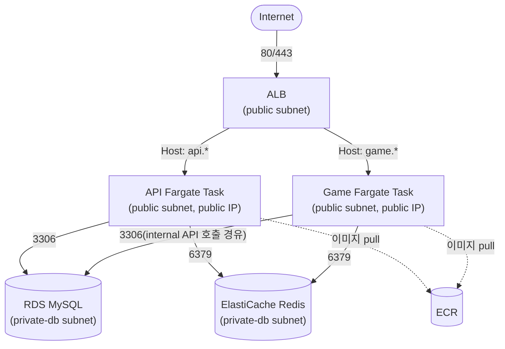

# 비용 절감을 위한 ECS Fargate 이관 계획

- 상태: Draft (단계 1 착수 전)
- 범위: `apps/api`, `apps/game`의 컴퓨트 계층을 EC2(`app_a`) 단일 인스턴스에서 ECR + ECS Fargate로 전환한다. RDS/ElastiCache/S3+CloudFront(web)/SES/DNS는 이번 이관 범위 밖이며 그대로 둔다(RDS는 이미 private).
- 관련 코드/설정: `infra/terraform/modules/{network,security,compute,load_balancer,iam,logging,monitoring,database,cache}`, `.github/workflows/deploy-api.yml`, `.github/workflows/deploy-game.yml`, [`ARCHITECTURE.md`](../../ARCHITECTURE.md) Observability 섹션

## 배경

현재 `apps/api`와 `apps/game`은 같은 EC2 인스턴스(`app_a`, private-app 서브넷)에서 PM2로 각자 다른 포트에 떠 있고, ALB가 Host 헤더 기준으로 두 타겟그룹(`app`/`game`)에 나눠 보낸다. [ADR-0004](../adr/0004-game-service-split.md)에서 두 서비스는 코드/배포 단위(프로세스)로는 이미 분리했지만, 인프라(컴퓨트) 단위는 여전히 하나의 인스턴스를 공유한다 — 한쪽 트래픽이 늘어도 인스턴스를 통째로 스케일해야 하고, 배포도 사실상 같은 서버 위에서 순차적으로 일어난다.

private-app 서브넷은 인터넷 아웃바운드를 위해 NAT Gateway(`infra/terraform/modules/network`)를 거치는데, NAT Gateway는 이 프로젝트에서 시간당 요금이 실제로 청구되는 몇 안 되는 네트워크 리소스다. Fargate 태스크를 public 서브넷 + public IP로 두면 IGW로 직접 아웃바운드가 가능해 이 NAT Gateway를 없앨 수 있다 — 이관 완료 후 비용 절감 효과가 있다. Inbound는 여전히 Security Group으로 ALB만 허용하므로(아래 SG 설계 참고), public IP를 갖는다고 해서 인터넷에 직접 노출되는 것은 아니다.

## 목표 아키텍처

- ALB는 지금과 동일하게 public 서브넷 + `security.public` SG를 그대로 쓴다. Host 헤더 기반 리스너 규칙(`load_balancer` 모듈)도 그대로 재사용 가능하다 — 타겟그룹의 `target_type`만 `instance`에서 `ip`로 바뀐다.
- API/Game 태스크는 **각자** public 서브넷에 배치하고 public IP를 할당한다(NAT Gateway 대체). 인바운드는 SG로 ALB에서만 허용하므로 인터넷에서 태스크 포트로 직접 접근할 수 없다.
- RDS/Redis는 지금처럼 private-db 서브넷에 남는다 — 이번 이관으로 바뀌지 않는다.

## 보안 그룹 설계

기존 `security` 모듈의 `app` SG 하나를 API/Game용으로 분리한다(현재는 인스턴스를 공유해서 SG도 하나였다).

| SG | Inbound | 비고 |
|---|---|---|
| `alb` (기존 `public`) | 80/443 ← `0.0.0.0/0` | 변경 없음 |
| `ecs_api` (신규, 기존 `app`에서 분리) | API 컨테이너 포트 ← `alb` SG | |
| `ecs_game` (신규, 기존 `app`에서 분리) | Game 컨테이너 포트 ← `alb` SG | |
| `db` (기존) | 3306 ← `ecs_api` SG, `ecs_game` SG | 현재는 `app` SG 하나만 허용 — 소스를 두 개로 교체 |
| `cache` (기존) | 6379 ← `ecs_api` SG, `ecs_game` SG | 위와 동일 |
| `bastion` (기존) | 22 ← `0.0.0.0/0` | 변경 없음, RDS/Redis 터널용으로 계속 필요 |

- 기존 `app` SG의 "SSH from bastion" 규칙은 ECS 태스크에는 필요 없다(SSH 접속 대상이 아님) — `ecs_api`/`ecs_game` SG에는 포함하지 않는다.
- 두 SG로 나누는 이유: API/Game이 서로 다른 서비스이므로(ADR-0004) 한쪽 컨테이너 포트 변경이 반대쪽 SG 규칙에 영향을 주지 않게 하기 위함. 지금 `app` SG가 포트 두 개를 함께 열어둔 것과 같은 이유로 나중에 다시 합쳐도 되지만, 처음부터 분리하는 편이 "같은 인스턴스를 공유해서 어쩔 수 없이 합쳐뒀다"는 현재 상태의 제약을 반복하지 않는다.

## Terraform 모듈 변경 범위

| 모듈 | 변경 |
|---|---|
| `modules/ecr` (신규) | api/game 이미지 리포지토리 2개, 수명주기 정책(오래된 미사용 이미지 정리) |
| `modules/ecs` (신규) | ECS 클러스터, api/game 태스크 정의, 서비스, (5단계부터) Auto Scaling 대상/정책 |
| `modules/iam` | 태스크 실행 역할(ECR pull, awslogs 쓰기) + 태스크 역할(현재 `app` 역할의 SES 발신 권한을 승계) 추가 |
| `modules/security` | `app` SG를 `ecs_api`/`ecs_game`로 분리 |
| `modules/load_balancer` | 타겟그룹 `target_type`을 `ip`로 변경, `aws_lb_target_group_attachment`를 EC2 attachment 대신 ECS 서비스가 직접 관리하도록 변경(서비스의 `load_balancer` 블록) |
| `modules/database`, `modules/cache` | SG 참조 변수를 `ecs_api_security_group_id`/`ecs_game_security_group_id`로 교체 |
| `modules/logging` | 기존 Log Group을 ECS `awslogs` 드라이버가 그대로 쓰도록 재사용(신규 불필요) |
| `modules/monitoring` | EC2 지표(`AWS/EC2`, CloudWatch Agent 커스텀 네임스페이스) → ECS 서비스 지표(`AWS/ECS` CPU/MemoryUtilization)로 대시보드/알람 교체 |
| `modules/compute` | 6단계 이후 `app_a` 인스턴스 제거(단계적 이관 중에는 유지 — 아래 이관 순서 참고). `bastion`은 계속 필요하므로 유지 |
| `modules/network` | `app_a`/NAT Gateway 제거가 끝난 뒤 private-app 서브넷/라우팅/NAT Gateway/EIP 정리(선택, 비용 절감이 목적이면 최종적으로 제거) |

## 이관 순서

사용자가 제시한 순서를 그대로 따르되, 각 단계의 완료 기준과 롤백 지점을 명시한다. `infra/terraform/CLAUDE.md`의 원칙대로 한 단계씩 진행하고 각 단계마다 `terraform fmt`/`validate`/`plan`을 거친다 — 여러 단계를 한 번의 큰 변경으로 묶지 않는다.

### 1단계 — Docker image / ECR

- `apps/api`, `apps/game` 각각 Dockerfile 작성(기존 PM2 실행 방식을 컨테이너 엔트리포인트로 대체).
- `modules/ecr` 추가, 리포지토리 2개 생성.
- 이미지 빌드 + ECR push는 `deploy-api.yml`/`deploy-game.yml`을 건드리지 않고 `.github/workflows/publish-ecr.yml`이라는 새 워크플로우로 분리한다 — 아직 어떤 배포에도 연결되지 않은 검증 단계이므로 기존 EC2 배포 워크플로우의 안정성에 영향을 주지 않기 위함이다. 이 워크플로우는 `main` push에 자동으로 걸지 않고 수동 실행(`workflow_dispatch`)만 허용한다(ECS가 아직 이미지를 소비하지 않는 상태에서 커밋마다 이미지가 쌓이는 것을 피하기 위함). 2단계(API ECS 전환)에서 실제 배포에 연결할 때 트리거를 다시 검토한다.
- CI가 ECR에 push할 때 assume하는 IAM Role(`ci_ecr_push`)은 `environments/bootstrap/ecr-push.tf`에 별도로 둔다 — `ci_deploy_metadata`/`ci_deploy_lambda`와 동일하게, `bootstrap`과 `prod`가 서로 다른 state를 쓰므로 module output을 참조하지 못하고 `project_name` 문자열로 리포지토리 ARN을 직접 구성한다.
- 완료 기준: 두 이미지가 ECR에 정상적으로 push되고, 로컬에서 pull해서 실행하면 기존 EC2 배포와 동일하게 동작한다.
- 진행 상태: Dockerfile/`modules/ecr`/`ecr-push.tf`/`publish-ecr.yml` 작성 완료(`terraform validate` 통과). `terraform apply`(bootstrap, prod)와 리포지토리 변수 `CI_ECR_PUSH_ROLE_ARN` 등록, 실제 워크플로우 실행 검증은 아직 남아 있다.

### 2단계 — API만 ECS Fargate 전환

- `modules/ecs`(클러스터 + api 서비스/태스크 정의), `modules/iam`(태스크 역할), `modules/security`(`ecs_api` SG) 추가.
- `load_balancer` 모듈의 `app` 타겟그룹을 `target_type = "ip"`로 바꾸고 ECS api 서비스가 이 타겟그룹에 등록하도록 연결.
- `database`/`cache` SG의 소스를 api 트래픽에 한해 `ecs_api` SG로 추가(기존 `app` SG는 game이 아직 EC2에 남아 있으므로 유지).
- Game은 여전히 `app_a` EC2에서 서비스한다 — API 트래픽만 Fargate로 넘어간다.
- 완료 기준: `api.*` 서브도메인 트래픽이 100% ECS 태스크로 서비스되고, `app_a`의 API 프로세스(PM2)는 트래픽을 받지 않는 상태로 대기(즉시 EC2에서 제거하지 않고 롤백 여유를 둔다).
- 롤백: ALB 리스너 default action을 다시 EC2 타겟그룹으로 돌리면 된다(EC2 API 프로세스가 아직 떠 있는 동안).

### 3단계 — 배포/로그/Tracing/AIOps 안정화

- `modules/monitoring` 대시보드/알람을 ECS 지표 기준으로 교체(EC2 CPU/Memory 알람 → ECS 서비스 CPU/MemoryUtilization, 태스크 개수/헬스 알람 추가).
- `packages/logger`/`packages/tracing`은 서비스 코드 변경 없이 stdout 기반으로 그대로 동작해야 한다(awslogs 드라이버가 stdout을 수집) — CloudWatch Agent 수동 설정(`infra/terraform/environments/prod/cloudwatch-agent/`)은 API 쪽부터 불필요해진다.
- `apps/aiops`(incident-analyzer 등, 최근 커밋 참고)가 EC2 로그 포맷/로그 그룹 가정에 의존하는 부분이 있는지 확인 — 로그 그룹 자체는 유지되므로 큰 변경은 없을 것으로 예상되나, 로그 스트림 네이밍(ECS는 `awslogs-stream-prefix/컨테이너명/태스크ID` 형식)이 바뀌므로 스트림 이름에 의존하는 필터가 있다면 함께 확인한다.
- 완료 기준: API 관련 대시보드/알람이 실제 운영 신호를 정상적으로 반영하고, 최소 1~2주 정도 안정적으로 운영되어 다음 단계(Game 부하 테스트) 진행에 대한 확신이 생긴다.

### 4단계 — Game multi-instance 부하 테스트

- Game은 Redis 기반 room 상태와 Socket.IO 커넥션을 물고 있다([ADR-0001](../adr/0001-room-realtime-state-and-reconnect.md)) — 인스턴스(태스크)가 여러 개로 늘어났을 때도 분산 락/재접속이 정상 동작하는지 **ECS로 옮기기 전에** 검증한다.
- 이 단계는 아직 인프라 변경이 없다 — 로컬 또는 스테이징성 환경에서 Game 프로세스를 여러 개 띄워 부하/재접속 테스트를 수행하는 애플리케이션 레벨 검증이다.
- 완료 기준: 다중 인스턴스에서 room 분산 락 fencing, Socket.IO 재접속, 라운드 스냅샷 캐시가 EC2 단일 인스턴스 대비 회귀 없이 동작함을 확인.

### 5단계 — Game ECS 전환

- 2단계와 동일한 패턴으로 `ecs_game` SG, game 태스크 정의/서비스 추가.
- `database`/`cache` SG 소스에 `ecs_game` SG 추가.
- 완료 기준: `game.*` 서브도메인 트래픽이 100% ECS로 전환. 이 시점에 `app_a` EC2 인스턴스가 더 이상 트래픽을 받지 않으므로, 안정화 기간(예: 1주) 후 `modules/compute`에서 `app_a` 리소스와 관련 IAM 역할을 제거한다.
- `app_a` 제거 이후 private-app 서브넷이 비게 되므로, `modules/network`의 NAT Gateway/EIP/private-app 라우팅 제거를 별도 변경으로 진행할 수 있다(비용 절감의 실질적 효과가 나는 지점 — 배경 섹션 참고). `bastion`은 public 서브넷에 그대로 있으므로 영향 없다.

### 6단계 — ECS Auto Scaling

- api/game 서비스에 각각 Application Auto Scaling 대상 등록, ECS 서비스 CPU/MemoryUtilization 기준 타겟 트래킹 정책 추가.
- Game은 room 상태를 Redis에 두므로(스티키 세션 불필요, ADR-0001) 태스크 개수 변화 자체는 안전하지만, Socket.IO 커넥션이 있는 태스크가 스케일 인으로 종료될 때의 연결 종료/재접속 동작을 확인한다.
- 완료 기준: 부하에 따라 태스크 수가 자동으로 늘고 줄며, 스케일 인 시점에 재접속 로직이 정상 동작.

## 함께 갱신해야 할 문서

각 단계가 실제로 완료될 때 다음 문서도 함께 갱신한다(코드/인프라만 바뀌고 문서가 뒤처지지 않도록):

- [`ARCHITECTURE.md`](../../ARCHITECTURE.md) Observability 섹션 — `PM2(파일) → CloudWatch Agent` 경로를 ECS `awslogs` 드라이버 경로로 교체.
- [`infra/terraform/CLAUDE.md`](../../infra/terraform/CLAUDE.md) Project Structure 섹션 — `compute`/`security`/`load_balancer` 모듈 설명과 신규 `ecr`/`ecs` 모듈 추가.
- 이관이 끝나고 나면 이 문서 대신 [`docs/adr/`](../adr/README.md)에 "왜 EC2에서 ECS Fargate로 전환했는지"를 정리한 ADR을 새로 남기는 편이 낫다 — 이 문서는 실행 계획(진행 중 상태가 바뀌는 문서)이고, ADR은 완료된 결정의 근거를 기록하는 문서라 성격이 다르다.

## 미해결 질문 / 리스크

- **외부 연동 IP allowlist 여부**: `apps/api`가 호출하는 OpenAI API, YouTube, Melon 차트 스크래핑([`ARCHITECTURE.md`](../../ARCHITECTURE.md) 외부 연동 표) 중 아웃바운드 IP를 고정으로 허용해둔 곳이 있는지 확인 필요. Fargate 태스크는 배포/스케일링마다 public IP가 바뀌므로, IP 고정이 필요한 연동이 있다면 NAT Gateway + private 서브넷 유지 또는 고정 IP용 별도 방안(NAT Gateway EIP 고정 등)이 필요해진다.
- **CI/CD 파이프라인 재작성**: `deploy-api.yml`/`deploy-game.yml`이 현재 EC2 SSH 배포 방식이라면 ECS 배포(이미지 push → 태스크 정의 새 리비전 등록 → 서비스 업데이트)로 전면 재작성이 필요하다. 1단계에서 빌드/푸시만 먼저 추가하고, 2단계에서 실제 서비스 업데이트 로직을 추가하는 순서를 권장한다.
- **bastion을 통한 RDS/Redis 접근**(`infra/terraform/environments/prod/scripts/`)은 이번 변경으로 영향받지 않는다 — bastion과 DB/Redis 모두 서브넷/SG가 그대로다.
- **RDS/Redis 커넥션 풀**: 태스크가 스케일 아웃될 때(6단계) 커넥션 수가 급증할 수 있으므로, RDS `max_connections`/애플리케이션 커넥션 풀 크기를 함께 검토한다.
